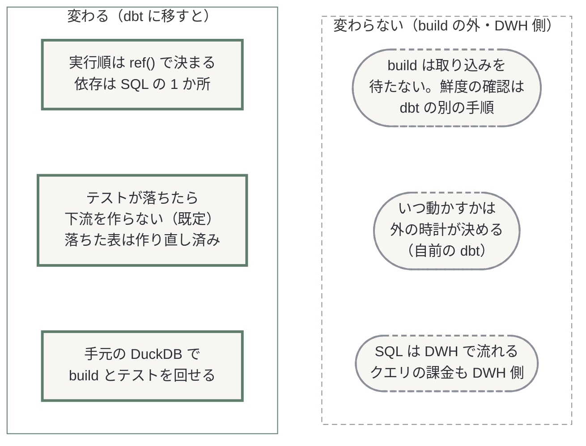
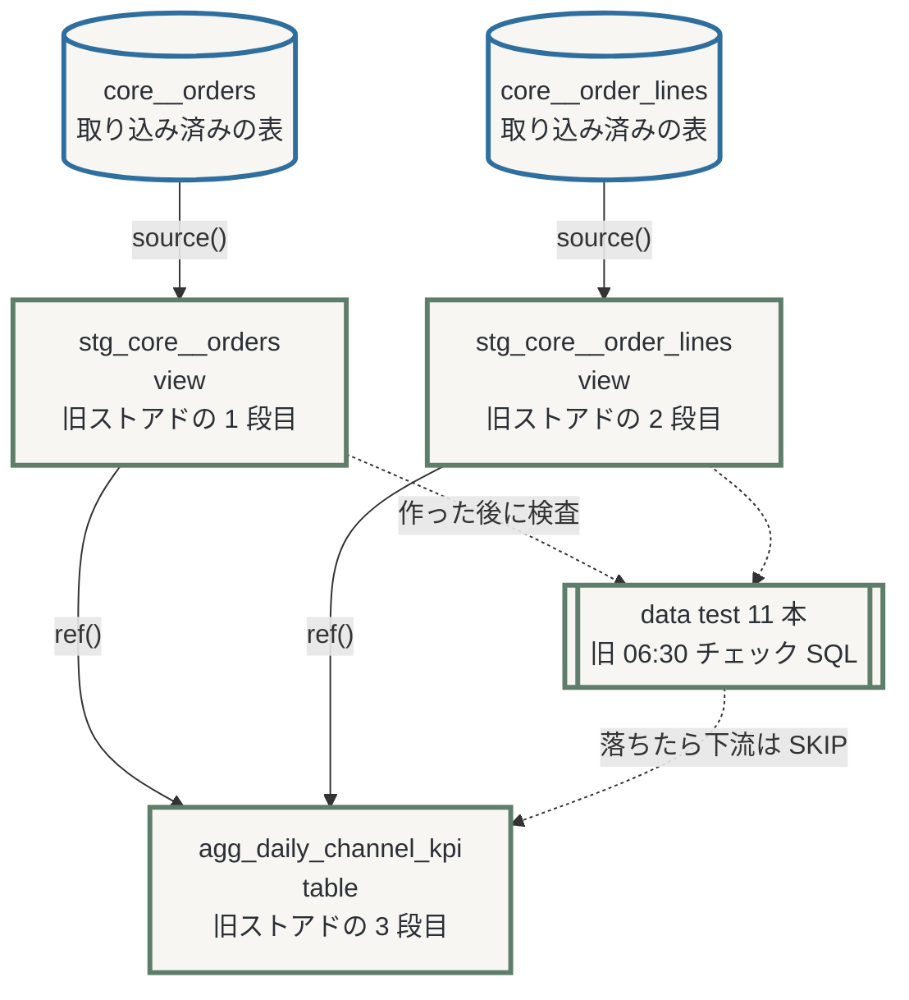
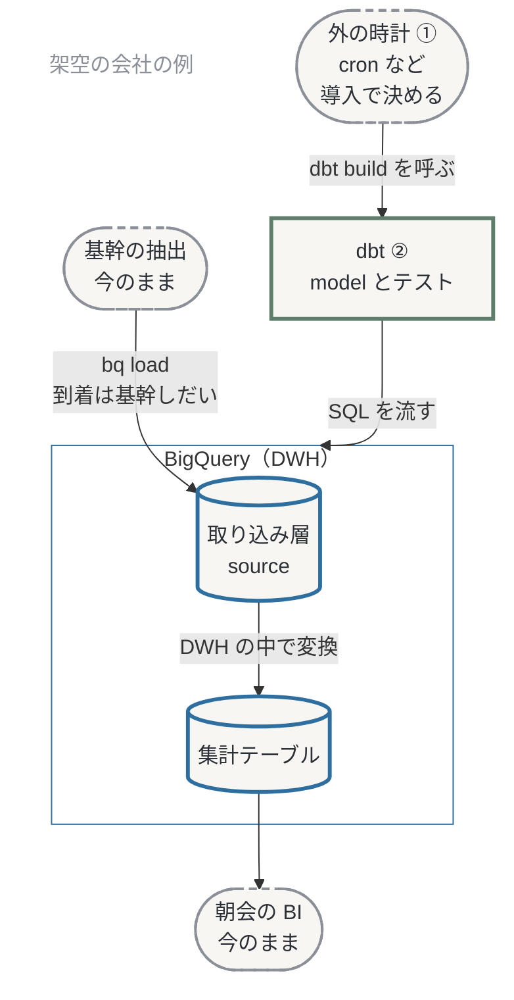
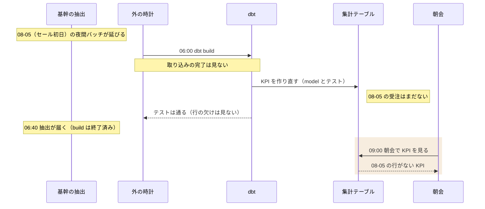
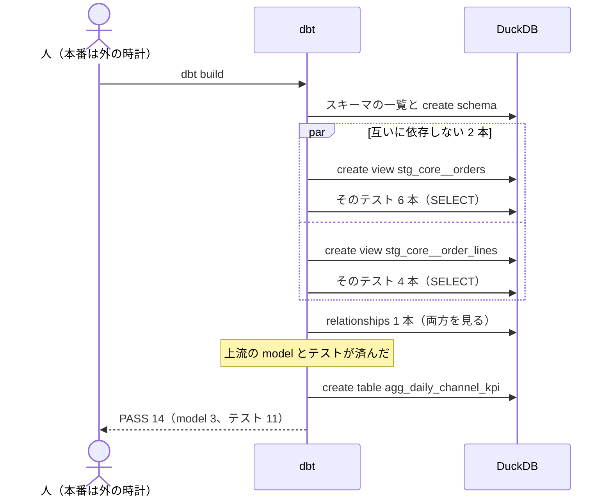
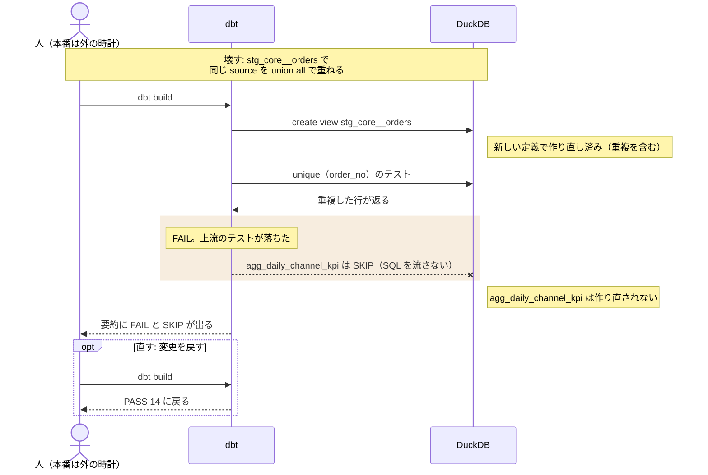

## 0. この記事について

**この章の問い**: 自分向けか。何分かかり、何が分かるか。

この記事は、データ基盤構築シリーズ dbt™ 編の 0話です。本編（1話〜）の前に置く序章で、dbt に移すと何が変わり、何が残るかの全体像を示します。本編は、1話がテストと鮮度の確認、2話が突合と CI、3話が品質の監視、4〜5話がセマンティックレイヤー、6話（予定）が起動と運用です。この記事の中の区切りは「章」と呼びます。

対象は、スケジュールクエリとストアドを担当し、dbt の導入の検討に出る方です。実行順やテストの変わり方は、外から見えにくい所です。読み終えると変化を説明でき、手元で確かめ、検討会で答えられます。差分更新（incremental）は後の回です。

**先に結論（3 行）**

1. 変わる: 表どうしの実行順は、SQL の中の ref() から自動で決まります。
2. 変わる: テストは表を作った後に走り、落ちれば下流を作りません（既定）。落ちた時点で、その表はもう作り直されています。
3. 変わらない: build は取り込みの完了を確かめません。自前の dbt では、いつ動かすかも外で決めます。


図 0: 変わるもの（左）と残るもの（右）。「別の手順」は dbt の source freshness、「外の時計」は自前の場合です。クエリの課金は DWH 側のままです（2026-10-03 確認）。

**読み方**: 概要は 0・1・2・6章、検討会の準備は＋3・5章、手を動かすなら＋4章です。見込みは読む 22 分、手を動かす 40 分です（初回の取得を除く）。読むだけなら記事で完結します。解説動画は 6章に置きます（準備中）。

**前提の用語**

| 用語 | 意味 |
|---|---|
| model | 主に SELECT 文を 1 つ書いた .sql ファイル |
| ref() | 別の model の参照。依存と実行順を決める |
| DAG | model どうしの依存を表すグラフ |
| data test | 違反する行を探す検査の SELECT |
| dbt build | model の作成とテストを依存の順に行う |

**動作確認環境（2026-10-04）**: Windows 11、Python 3.12.10（PC のものを uv が使用）。dbt-core 1.12.5、dbt-duckdb 1.11.0、duckdb 1.5.6 です。

**筆者について**: dbt を使い始めたころは、BigQuery にいつクエリが流れ、いくらかかるのかが分かりませんでした。それから 2 年、BigQuery を中心に dbt を使ってきました。

> この記事の舞台は、あるコーヒー・食品の大手通販（架空）です。設定、数字、障害は架空のもので、各製品で実際に起きた障害ではありません。実在の企業や、筆者の所属先・取引先とは関係なく、データはすべて合成です。各製品の仕様は 2026 年 10 月時点の公式情報によります。

**持ち帰る 1 文**: 実行順とテストの止め方は変わり、取り込みを待たない点は変わりません。

## 1. dbt に移すと、何が実行順を決めるのか

**この章の問い**: 表どうしの実行順は、何で決まるのか。

:::message
**あなたの現場では**: 起動時刻の前後に頼っていた順番は ref() に、チェック SQL は data test になります。
:::

### model と ref()

model には CREATE や INSERT を書きません。表やビューを作る文は dbt が包んで流します。FROM 句には表の名前を書かず、ref() で参照します（取り込み済みの表は source()）。

```sql:models/marts/agg_daily_channel_kpi.sql（6〜26 行目）
with orders as (

    select
        order_no,
        order_date,
        channel_code,
        shipping_fee_incl_tax
    from {{ ref('stg_core__orders') }}
    where order_status != 'CANCELLED'

),

lines as (

    select
        order_no,
        sum(unit_price_sen * quantity) as line_amount_sen
    from {{ ref('stg_core__order_lines') }}
    group by order_no

)
```

列名の sen は銭です（3章）。

:::details 実行時の同じ箇所（ref() が表の名前になる）
スキーマ名も dbt が埋め込むので、SQL には書きません。

```sql:target/compiled/…/agg_daily_channel_kpi.sql（6〜26 行目）
with orders as (

    select
        order_no,
        order_date,
        channel_code,
        shipping_fee_incl_tax
    from "ec_analytics"."ec_staging"."stg_core__orders"
    where order_status != 'CANCELLED'

),

lines as (

    select
        order_no,
        sum(unit_price_sen * quantity) as line_amount_sen
    from "ec_analytics"."ec_staging"."stg_core__order_lines"
    group by order_no

)
```
:::

### ref() から描かれる DAG

dbt build は、ref() から組み上がった DAG の順に model とテストを流します。


図 1: テストは model の後、下流の前に走り、落ちると（既定）下流は SKIP です。

### dbt が受け持つもの

dbt が担うのは DWH の中の変換（ELT の T）で、抽出とロード（E と L）は他のツールが担います。

変換だけのツールと思っていた筆者には、seed や source freshness（付録の用語マップ）が取り込みの周辺に手が届くのが意外でした。テストと、列の説明からのドキュメントの生成も、同じプロジェクトに置けます。

### 確認問題 1

自前の dbt の場合、次の 8 つを dbt が受け持つものと dbt の外に残るものに分けてください。

- API からの取り込み、bq load での大量のロード、小さな対応表の CSV を DWH に載せる、取り込んだ表の鮮度の確認
- SELECT の中での重複の除去、毎朝の起動、列の説明からドキュメントを生成する、集計のテスト

:::details 答え
dbt の外に残るのは API からの取り込み、bq load、毎朝の起動です。残りの 5 つは順に seed、source freshness、model の SELECT、ドキュメントの生成、data test が受け持ちます。source freshness は build と別のコマンドです。
:::

**持ち帰る 1 文**: 依存を ref() に書けば実行順は dbt が決め、テストが落ちれば（既定）下流も止まります。

## 2. 検討会で並べる 3 つ — 自前の dbt、dbt platform、Dataform

**この章の問い**: 何と比べ、何が違うのか。

:::message
**あなたの現場では**: 自前の dbt は、cron などの外の道具から dbt build を呼びます。何に呼ばせるか（起動役）も、導入で決めます（6話）。
:::


図 2: 3章の架空の会社に dbt を入れた後の構成。①（起動役）は導入で決めます（スケジュールクエリで呼べるかは未確認）。

- **dbt v1**: 旧 dbt Core™ 1.x。自前で動かす Apache 2.0（2026-10-03 確認）の道具で、4章で使います。
- **dbt platform**: 旧 dbt Cloud™。ホスト型のサービスです。
- **Dataform**: 変換を SQLX で書く Google Cloud のサービスで、依存は `${ref()}` です。

| 観点（2026-10-03 確認） | 自前の dbt v1 | dbt platform | Dataform |
|---|---|---|---|
| テストが落ちたとき | 下流を SKIP（既定） | 同左 | 既定では下流も実行（設定で止められる） |
| 手元で動く範囲 | DuckDB で build とテスト | —（ホスト型。DuckDB は v2 の接続一覧になし） | コンパイルまで |
| 開発環境 | PC ごとに Python（uv で仮想環境を用意） | ブラウザの Studio IDE | この記事では扱わない |
| いつ動かすか | 外の道具から呼ぶ | ジョブ（時刻は UTC） | ワークフロー設定など |
| ライセンス料 | 0 円（人手と DWH の課金は別） | 下の料金表 | 無料（実行とログの課金は別） |
| 席とアカウント | — | Starter は 5 席まで。Developer・Starter のアカウントは米国（東京は Enterprise 系） | — |
| 向けられる DWH | アダプタで選ぶ | 接続一覧の DWH | BigQuery だけ |

**dbt platform の料金（2026-10-03 確認）**

| プラン | 価格 | 席 | 月に含まれる成功した model の数（本番など） |
|---|---|---|---|
| Developer | 無料 | 1 | 3,000 |
| Starter | 1 人あたり月 100 ドル | 5 | 15,000 |
| Enterprise | 個別見積もり | — | 100,000 |

テストは数えず、DWH の料金は別です。契約の時期で数が違うこともあります。

### 確認問題 2

次の 2 チームは、まず何で試すべきでしょうか（理由を 2 つずつ）。

- X: 3 人。Python の導入申請に数か月。DWH は BigQuery だけ。運用の担当なし。
- Y: 8 人。Python を入れられる。DWH は BigQuery ともう 1 つ。SaaS のアカウントを国外に置けない。

:::details 答えの例（2026-10-03 確認）

- X: platform です。ブラウザで開発でき、5 席以内で、起動もジョブに任せられます。Dataform も BigQuery だけで足りますが、開発環境は未確認です。
- Y: 自前の dbt v1 です。ライセンス料は 0 円で、BigQuery 以外にも向けられます。platform は 5 席を超え、アカウントを東京に置くには Enterprise 系が要ります。
:::

**持ち帰る 1 文**: 3 つの差は、テストの既定、手元で回せる範囲、開発環境、席とアカウント（2026-10-03 確認）にあります。

## 3. セールの 2 つの朝 — dbt で変わらない朝と変わる朝

**この章の問い**: この会社の朝で、何が変わり、何が残るのか。

舞台は 0章の通販（架空）です。日次 KPI はストアドが毎朝 06:00 に作り、06:30 のチェック SQL で確かめ、09:00 の朝会で見ます。

**変わらない朝（08-06）**: セール初日の翌朝、基幹の抽出が 02:30 ではなく 06:40 に届き、06:00 の KPI は受注が欠けました。dbt でも同じで、build は取り込みの完了を確かめず、鮮度の確認も含みません。


図 3: 架空の会社の 08-06 の朝。build は 06:40 の到着を待たず、この例のテストも通って終わります。

**変わる朝（08-07）**: KPI のストアドは、受注の集計（スケジュールクエリ）の表を読みます。いつもは数分の集計がこの朝は 35 分かかり、KPI は前日の集計を読みました。集計も model にして ref() で読めば、KPI は集計の後に作られ、09:00 の朝会に間に合います。lab に受注の集計はなく、KPI が staging の後に作られる順を 4章で確かめます。

### 確認問題 3

08-06 の朝、(a) 06:00 起動のスケジュールクエリと (b) cron が 06:00 に呼ぶ dbt build では、何が起きるでしょうか。(b) で受注の集計も model にすると、08-07 の朝は (a) と (b) で何が違うでしょうか。

:::details 答え
08-06 はどちらも欠けた KPI を作ります。この例のテストは行の欠けを見ないので、(b) も通って終わります。08-07 は、(a) は前日の集計を読みえますが、(b) は集計の後に作ります。
:::

### 3 つの model への分解

:::message
**あなたの現場では**: ストアドの INSERT-SELECT の各段は、SELECT の部分を取り出せば model になります。
:::

source は取り込み済みの表の宣言です。0話はそれを整える staging（view）2 つと、集計の marts（table）1 つに分けました。

| 旧ストアドの手順 | 0話の model | 変えたこと（旧 → 新） |
|---|---|---|
| 1 受注を集める | stg_core__orders | 受注日: UTC の日付 → JST の日付 |
| 2 明細の金額 | stg_core__order_lines | 単価を銭の整数にする |
| 3 日次 × チャネルの集計 | agg_daily_channel_kpi | キャンセル: 含む → 除く。金額: 税抜の推計 → 税込（卸は税抜のまま。2話） |

KPI の数字が変わるのは、dbt のせいではなく、移行で旧ストアドの定義を直したからです。旧と新は並走させて突き合わせます（2話）。

**持ち帰る 1 文**: 集計が長引いた朝の読み違いは ref() で防げますが、抽出の遅れによる欠けは dbt でも残ります。

## 4. ハンズオン — build で何が流れ、どこで止まるか

**この章の問い**: build は何本の SQL をどの順に流し、どこで止まるのか。

:::message
**あなたの現場では**: 朝のチェック SQL は、model の直後に走る data test になり、落ちれば（既定）下流を作りません。
:::

### 構成と準備

ハンズオンはタグ ep0-end を使い、手元の DuckDB を DWH の代わりにします。BigQuery との SQL の違いは確かめていません。

https://github.com/e8dev-note/ec-analytics-handson/tree/ep0-end

```text
.
|-- dataform/
|-- expected/
|   |-- s__clean__2026-10-01.json
|   `-- xs__clean__2026-10-01.json
|-- generator/
|-- macros/
|-- models/
|   |-- marts/
|   |   |-- _marts.yml
|   |   `-- agg_daily_channel_kpi.sql
|   `-- staging/
|       `-- core/
|           |-- _core__models.yml
|           |-- _core__sources.yml
|           |-- stg_core__order_lines.sql
|           `-- stg_core__orders.sql
|-- scripts/
|   |-- check_hygiene.py
|   |-- check_targets.py
|   `-- load_duckdb.py
|-- dbt_project.yml
|-- profiles.yml
|-- pyproject.toml
|-- README.md
`-- uv.lock
（省略: dataform/・generator/・macros/ の中身、.github/、docs/、ルートのドットファイル 4 個と LICENSE）
```

README の「セットアップ」で、clone、uv sync、PYTHONUTF8 などの設定を済ませます。データは規模 xs で、本文の数字も xs のものです（README の既定は s）。

```powershell
uv run python -m generator --scale xs --preset clean
uv run python scripts/load_duckdb.py --reset-db
```

:::details つまずき: 初回の uv sync とプロキシ
初回は dbt-core-experimental-parser のビルドが、OS 用のファイルを GitHub Releases から取得します。.venv に置かれる実行ファイルは約 274 MB です。uv の通信は HTTPS_PROXY と、OS の証明書ストアを使う設定（社内 CA）で通しますが、この取得まで通るかは未確認です。コマンドはコンソールに貼り付けます（.ps1 は実行ポリシーで動かない PC がある）。
:::

:::details つまずき: 'cp932' の UnicodeDecodeError
日本語版 Windows で PYTHONUTF8 がないと、dbt parse や build が終了コード 2 で止まります。日本語のコメントがある dbt_project.yml を、文字コードの指定なしで読むためです。

```text
（前略: 版の表示）
15:46:34  [ERROR]: Encountered an error:
'cp932' codec can't decode byte 0x81 in position 25: illegal multibyte sequence
（中略: Traceback）
UnicodeDecodeError: 'cp932' codec can't decode byte 0x81 in position 25: illegal multibyte sequence
```

生成とロードの後の dbt debug は通るので、気づきにくい所です。
:::

### 4-1. build で作られる 3 つの表

```powershell
uv run dbt build
```

```text
（前略: 版の表示など 3 行）
15:47:45  Found 3 models, 11 data tests, 2 sources, 507 macros
15:47:45  
15:47:45  Concurrency: 4 threads (target='dev')
15:47:45  
15:47:45  1 of 14 START sql view model ec_staging.stg_core__order_lines .................. [RUN]
15:47:45  2 of 14 START sql view model ec_staging.stg_core__orders ....................... [RUN]
15:47:45  2 of 14 OK created sql view model ec_staging.stg_core__orders .................. [OK in 0.10s]
15:47:45  1 of 14 OK created sql view model ec_staging.stg_core__order_lines ............. [OK in 0.10s]
（中略: テスト 11 本の START と PASS）
15:47:46  14 of 14 START sql table model ec_marts.agg_daily_channel_kpi .................. [RUN]
15:47:46  14 of 14 OK created sql table model ec_marts.agg_daily_channel_kpi ............. [OK in 0.06s]
15:47:46  
15:47:46  Finished running 1 table model, 11 data tests, 2 view models in 0 hours 0 minutes and 0.40 seconds (0.40s).
15:47:46  
15:47:46  Completed successfully
15:47:46  
15:47:46  Done. PASS=14 WARN=0 ERROR=0 SKIP=0 NO-OP=0 REUSED=0 TOTAL=14
```

model 3 とテスト 11 の計 14 が PASS しました（時刻は UTC）。

build の直後に、正解ファイルと照合します（KPI の表は 894 行）。

```powershell
uv run python scripts/check_targets.py --expected expected/xs__clean__2026-10-01.json
```
```text
expected/xs__clean__2026-10-01.json: build {'success': 3, 'pass': 11}、pass 以外 0 件、マート 1 表
OK: 正解ファイルと一致
```

作り方（materialization）は dbt_project.yml で層ごとに決め、view も table も build のたびに作り直されます。

```yaml:dbt_project.yml（23〜31 行目）
models:
  ec_analytics:
    # staging はビュー、マートはテーブルにする（フォルダごとに決める）
    staging:
      +schema: staging
      +materialized: view
    marts:
      +schema: marts
      +materialized: table
```

dbt show も、照合が読む run_results.json を上書きするので、照合は show の前に済ませます。

```powershell
uv run dbt show --output json --inline "select table_schema, table_name, table_type from information_schema.tables where table_schema in ('ec_staging', 'ec_marts') order by 1, 2"
```

```text
（前略: 実行の表示）
{
  "show": [
    {
      "table_schema": "ec_marts",
      "table_name": "agg_daily_channel_kpi",
      "table_type": "BASE TABLE"
    },
    {
      "table_schema": "ec_staging",
      "table_name": "stg_core__order_lines",
      "table_type": "VIEW"
    },
    {
      "table_schema": "ec_staging",
      "table_name": "stg_core__orders",
      "table_type": "VIEW"
    }
  ]
}
```

:::details つまずき: DuckDB のファイルが使用中
別のプロセスが DuckDB のファイルを読み書きで開いていると止まります（閉じれば通る）。

```text
（前略: 状況の説明、版と実行の表示）
15:54:38  [ERROR]: Encountered an error:
IO Error: Cannot open file "C:\architect\labs\_dryrun-ep0\data\ec_analytics.duckdb": プロセスはファイルにアクセスできません。別のプロセスが使用中です。
（後略: 開いているプロセスのパスと Traceback）
```
:::

### 4-2. 記録に残った SQL の本数と順番


図 4: threads 4 の lab では、依存のない 2 つが並んで走りました（簡略化した図です）。

SQL は target/ と logs/dbt.log に、状態と時刻は run_results.json に残ります。テストは対象の model の後に、KPI は 11 本のテストの後に始まっていました。lab の relationships のテストは、落ちても下流を止めない設定です（1話）。

dbt.log から並べた要約です（時刻は JST。名前などは途中まで）。

```text
（前略: 本数の集計と node ごとの内訳 22 行）
  1 00:47:45.817201 ThreadPool  list_ec_analytics                                                        select schema_name
  2 00:47:45.817201 ThreadPool  list_ec_analytics                                                        select schema_name
  3 00:47:45.844759 ThreadPool  create_ec_analytics_ec_marts                                             select type from duckdb_databases()
  4 00:47:45.845256 ThreadPool  create_ec_analytics_ec_staging                                           select type from duckdb_databases()
  5 00:47:45.848758 ThreadPool  create_ec_analytics_ec_marts                                             create schema
  6 00:47:45.849755 ThreadPool  create_ec_analytics_ec_staging                                           create schema
  7 00:47:45.859255 ThreadPool  list_ec_analytics_ec_marts                                               select ... from information_schema.tables
  8 00:47:45.859757 ThreadPool  list_ec_analytics_ec_staging                                             select ... from information_schema.tables
  9 00:47:45.899787 Thread-2 (  model:stg_core__orders                                                   create view
 10 00:47:45.900286 Thread-1 (  model:stg_core__order_lines                                              create view
 11 00:47:45.903796 Thread-2 (  model:stg_core__orders                                                   alter view
 12 00:47:45.905799 Thread-1 (  model:stg_core__order_lines                                              alter view
 13 00:47:45.968855 Thread-2 (  model:stg_core__orders                                                   drop view
 14 00:47:45.969853 Thread-1 (  model:stg_core__order_lines                                              drop view
 15 00:47:46.014895 Thread-2 (  test:not_null_stg_core__orders_order_no                                  select count(*) as failures
 16 00:47:46.017392 Thread-1 (  test:not_null_stg_core__orders_channel_code                              select count(*) as failures
 17 00:47:46.021407 Thread-4 (  test:accepted_values_stg_core__orders_channel_code__WEB__SUBSCRIPTION__M select count(*) as failures
 18 00:47:46.021407 Thread-3 (  test:not_null_stg_core__orders_order_date                                select count(*) as failures
 19 00:47:46.053460 Thread-2 (  test:not_null_stg_core__orders_order_status                              select count(*) as failures
 20 00:47:46.060461 Thread-1 (  test:unique_stg_core__orders_order_no                                    select count(*) as failures
 21 00:47:46.070467 Thread-3 (  test:accepted_values_stg_core__order_lines_tax_rate_pct__False__8__10    select count(*) as failures
 22 00:47:46.070968 Thread-4 (  test:accepted_values_stg_core__order_lines_price_tax_basis__INCL__EXCL   select count(*) as failures
 23 00:47:46.085974 Thread-2 (  test:not_null_stg_core__order_lines_order_no                             select count(*) as failures
 24 00:47:46.097482 Thread-1 (  test:relationships_stg_core__order_lines_order_no__order_no__ref_stg_cor select count(*) as failures
 25 00:47:46.099482 Thread-4 (  test:unique_stg_core__order_lines_order_no_cast_line_no_as_varchar_      select count(*) as failures
 26 00:47:46.138493 Thread-3 (  model:agg_daily_channel_kpi                                              create table
 27 00:47:46.156494 Thread-3 (  model:agg_daily_channel_kpi                                              alter table
 28 00:47:46.163074 Thread-3 (  model:agg_daily_channel_kpi                                              drop table
```

準備直後の 1 回目の build で dbt が流した SQL は、BEGIN と COMMIT を除き 28 本でした。スキーマの処理 8 本、model ごとに 3 本（仮の名前で作り、改名し、古いものを消す）、テストごとに 1 本です。どれも DuckDB での数で、BigQuery のジョブ数とは限りません。

:::details unique のテスト 1 本の SQL
2 行以上ある order_no を数え、0 でなければ落ちます。

```sql:target/run/…/unique_stg_core__orders_order_no.sql

    
    select
      count(*) as failures,
      count(*) != 0 as should_warn,
      count(*) != 0 as should_error
    from (
      
    
  
    
    

select
    order_no as unique_field,
    count(*) as n_records

from "ec_analytics"."ec_staging"."stg_core__orders"
where order_no is not null
group by order_no
having count(*) > 1


  
  
      
    ) dbt_internal_test
```
:::

**BigQuery の最低課金**

BigQuery で build を流すと、オンデマンド課金ではクエリ 1 本ごと、参照する表ごとに最低 10 MiB が課金されます（2026-10-03 確認）。

### 4-3. テストが落ちたときに止まるもの


図 5: テストが落ちた model はもう作り直されていて、止まるのは下流だけです。図の FAIL は、要約では ERROR=1 と数えます。

落とすのは order_no の unique のテストです。

```yaml:models/staging/core/_core__models.yml（1〜7 行目）
models:
  - name: stg_core__orders
    description: 基幹の受注ヘッダ（1 行 = 1 受注）。order_date は JST の受注日。
    columns:
      - name: order_no
        description: 受注番号（'O' + 10 桁）
        data_tests: [unique, not_null]
```

壊す前と後で、行数と KPI の合計を見ます。

```powershell
uv run dbt show --inline "select (select count(*) from {{ ref('stg_core__orders') }}) as stg_orders_rows, (select count(*) from {{ ref('agg_daily_channel_kpi') }}) as agg_rows, (select sum(order_count) from {{ ref('agg_daily_channel_kpi') }}) as agg_sum_order_count, (select sum(order_amount_gross) from {{ ref('agg_daily_channel_kpi') }}) as agg_sum_amount"
```

```text
（前略: 実行の表示）
| stg_orders_rows | agg_rows | agg_sum_order_count | agg_sum_amount |
| --------------- | -------- | ------------------- | -------------- |
|           18580 |      894 |               17829 |       99975718 |
```

取り込みの二重実行をまねて from を次のように変え、もう一度 build します。

```diff
diff --git a/models/staging/core/stg_core__orders.sql b/models/staging/core/stg_core__orders.sql
index fd4f8c4..06f5a15 100644
--- a/models/staging/core/stg_core__orders.sql
+++ b/models/staging/core/stg_core__orders.sql
@@ -21,4 +21,9 @@ select
     created_at,
     updated_at,
     _loaded_at
-from {{ source('core', 'orders') }}
+from (
+    -- 壊す（SC-03）: 取り込みの二重実行を模して、同じ source をもう一度 union all で重ねる
+    select * from {{ source('core', 'orders') }}
+    union all
+    select * from {{ source('core', 'orders') }}
+) as doubled
```

```text
（前略）
15:51:12  2 of 14 OK created sql view model ec_staging.stg_core__orders .................. [OK in 0.06s]
（中略）
15:51:12  8 of 14 FAIL 18580 unique_stg_core__orders_order_no ............................ [FAIL 18580 in 0.04s]
（中略）
15:51:12  14 of 14 SKIP relation ec_marts.agg_daily_channel_kpi .......................... [SKIP]
（中略）
15:51:12    Got 18580 results, configured to fail if != 0
（中略）
15:51:12  Done. PASS=12 WARN=0 ERROR=1 SKIP=1 NO-OP=0 REUSED=0 TOTAL=14
```

unique が FAIL、KPI が SKIP、ほかのテスト 10 本と view 2 つは PASS です。18580 は重複した order_no の数で、終了コードは 1 でした。

壊した後の値です。

```text
（前略: 実行の表示）
| stg_orders_rows | agg_rows | agg_sum_order_count | agg_sum_amount |
| --------------- | -------- | ------------------- | -------------- |
|           37160 |      894 |               17829 |       99975718 |
```

テストが落ちた stg_core__orders は 2 倍の行で作り直され、KPI の表は前回の内容（行数も合計も同じ）のまま残りました。

```powershell
git restore models/staging/core/stg_core__orders.sql
uv run dbt build
```
```text
（前略: 実行の表示）
15:51:35  Done. PASS=14 WARN=0 ERROR=0 SKIP=0 NO-OP=0 REUSED=0 TOTAL=14
```


### 4-4. 緑のまま欠ける KPI

3章の 08-06 の朝を、抽出が遅れる設定（late_core_batch）で再現します。

```powershell
uv run python -m generator --scale xs --preset clean --inject late_core_batch
uv run python scripts/load_duckdb.py --reset-db --as-of 2026-08-06T06:00+09:00
uv run dbt build
```
```text
（前略: 実行の表示）
15:52:09  Done. PASS=14 WARN=0 ERROR=0 SKIP=0 NO-OP=0 REUSED=0 TOTAL=14
```

すべて PASS です。KPI を日付ごとに見ます。

```powershell
uv run dbt show --inline "select kpi_date, sum(order_count) as order_count, sum(order_amount_gross) as order_amount_gross from {{ ref('agg_daily_channel_kpi') }} where kpi_date between '2026-08-03' and '2026-08-06' group by kpi_date order by kpi_date"
```

```text
（前略: 実行の表示）
|   kpi_date | order_count | order_amount_gross |
| ---------- | ----------- | ------------------ |
| 2026-08-03 |         137 |             920003 |
| 2026-08-04 |         108 |             650527 |
```

:::details 遅れなしと比べる手順
--inject なしで生成し、同じ手順で見ます。

```powershell
uv run python -m generator --scale xs --preset clean
uv run python scripts/load_duckdb.py --reset-db --as-of 2026-08-06T06:00+09:00
uv run dbt build
uv run dbt show --inline "select kpi_date, sum(order_count) as order_count, sum(order_amount_gross) as order_amount_gross from {{ ref('agg_daily_channel_kpi') }} where kpi_date between '2026-08-03' and '2026-08-06' group by kpi_date order by kpi_date"
```
:::

```text
（前略: 実行の表示）
|   kpi_date | order_count | order_amount_gross |
| ---------- | ----------- | ------------------ |
| 2026-08-03 |         137 |             920003 |
| 2026-08-04 |         134 |             846324 |
| 2026-08-05 |         171 |            1040053 |
```

上は遅れあり、下は遅れなしです。緑なのに 08-05 の行がなく、08-04 も 134 件から 108 件に減りました（理由は未確認）。この例のテスト 11 本は行の欠けを見ないので、緑のまま終わります。

:::details 元に戻す手順
生成からやり直し、正解ファイルと照合します。

```powershell
uv run python -m generator --scale xs --preset clean
uv run python scripts/load_duckdb.py --reset-db
uv run dbt build
uv run python scripts/check_targets.py --expected expected/xs__clean__2026-10-01.json
```

```text
expected/xs__clean__2026-10-01.json: build {'success': 3, 'pass': 11}、pass 以外 0 件、マート 1 表
OK: 正解ファイルと一致
```
:::

**持ち帰る 1 文**: DuckDB の build は model とテストより多い SQL を依存の順に流し、テストが落ちれば（既定）下流を止めます。

## 5. 検討会で聞かれること

**この章の問い**: 検討会で何を聞かれ、どう答えるか。

**問い 1（朝会の参加者、上司）: セール初日の翌朝は防げたのか**
いいえ。build は取り込みの完了を確かめません。遅れに気づくのは、build の前に別に呼ぶ source freshness で、取り込み時刻が古いと警告かエラーにします（1話）。鮮度のエラーで build を呼ばなくても、朝会には前回の KPI が出ます。防ぐには、取り込みの完了を合図に build を起動する方法があります（6話）。

**問い 2（上司、経理）: 費用はどうなるのか**
ライセンス料は自前なら 0 円、platform は Starter なら 1 人あたりの料金です（2章。2026-10-03 確認）。別に DWH の費用がかかり、model とテストのたびにクエリが流れます（4章）。チェック SQL はテストに置き換わり、自前なら dbt を動かす環境も要ります。

**問い 3（上司）: スケジュールクエリとストアドを全部作り直すのか**
取り込みは残ります。自前の dbt なら、build を動かす環境と起動役が今あるかを確かめ、なければ用意します（6話）。移すのは変換で、SELECT はほぼそのまま model に、増分の MERGE は incremental になります。変数や分岐、日付の引数を使う手続きは、別に洗い出します。筆者は導入後、洗い替えか incremental かの検討が足りず、データの欠損や重複を経験しました。

**問い 4（上司）: dbt を入れれば品質は保証されるのか**
いいえ。筆者も導入後に、テスト不足でデータが一時的に不整合になりました。build が止めるのは下流までで、何を検査するかは人が決めます（1話）。

**問い 5（朝会の参加者）: テストが落ちた朝、朝会には何が出るのか**
上流のテストなら（既定）、KPI の表は前回の build のまま残り、KPI 自身のテストなら作り直し済みです（4-3）。build は終了コード 1 で終わるので、起動する側でそれを見て知らせます。

**問い 6（運用担当）: 本番では何が build を起動するのか**
たとえば次の 4 つがあります（2026-10-03 確認）。

- cron
- platform のジョブ
- Managed Service for Apache Airflow（旧 Cloud Composer）
- Cloud Scheduler と Cloud Run jobs（構成の例。dbt と組む公式の案内は未確認）

比べる観点（取り込みとのつなぎ方、再実行、費用、手間）は、筆者も比較しきれていません（6話）。

**問い 7（情報システム部）: PC とネットワークの申請に何が要るのか**
Python 本体と uv、git、パッケージの取得先と GitHub Releases への接続、プロキシと社内 CA の設定です（4章のつまずき）。ホスト名の一覧と、dbt に渡す BigQuery の権限は、本記事では扱いません。

**持ち帰る 1 文**: 翌朝の欠けには build と別の source freshness で気づけ、取り込みを合図にした起動で防ぐ方法があります。

## 6. まとめと次の一歩

**この章の問い**: 明日から何をするか。

まとめは 0章の「先に結論」の 3 行です。

### 持ち帰りキット

**(a) 自社で確かめること**

1. 06:00 前後に起動し、ほかのクエリの結果を読むクエリの組
2. 今のスケジュールクエリとストアドの月の費用と、最低課金の規則（2026-10-03 確認、4章）
3. 社用 PC で uv sync が通るか（パッケージの取得先と github.com、社内 CA）
4. 取り込みがいちばん遅く届いた日
5. platform を使うなら、人数とアカウントの置き場所（2026-10-03 確認）
6. 自前なら、build を動かす環境と起動役があるか

**(b) 聞く質問と相手**

- 変わる KPI の定義を誰が承認するか → KPI 定義書の持ち主
- PC への Python と uv、github.com などへの接続 → 情報システム部
- 取り込みが遅れたら誰が知らせるか → 基幹の保守の担当、運用担当
- 本番で dbt build を呼ぶ起動役を何にするか → 運用担当
- platform を使うなら、アカウントに何が置かれるか → 情報システム部

**(c) 1 枚図**: 0章の図 0 です。

解説動画は準備中です。

### 次の一歩

次の 1話は、テストと source freshness です。

:::details v2 ではこう変わる

| 名前（2026-10-03 時点） | 以前の名前 | ライセンス・形態 |
|---|---|---|
| dbt v1（この記事） | dbt Core 1.x | Apache 2.0 |
| dbt（v2 のフル版） | dbt Fusion | プロプライエタリ |
| dbt OSS（v2） | dbt Core v2.0 | Apache 2.0 |
| dbt platform | dbt Cloud | ホスト型のサービス |

v2 の GA は 2026-09-16 に告知されました。pip install dbt で入るのはフル版で、v1 は当面 pip install dbt-core で入ります（2026-10-03 確認）。v2 への移行は 6話（予定）で、フル版の利用条件は未確認です。
:::

**持ち帰る 1 文**: 06:00 前後で依存し合う処理を 1 組選び、ref() で書けるかを確かめます。

## 付録

### 用語マップ

| 語 | 位置づけ |
|---|---|
| seed | 小さな CSV を表として読み込む。大量のロードには向かない（1話） |
| source freshness | 取り込み時刻で鮮度を確かめる。build とは別（1話） |
| Jinja | SQL に組み合わせるテンプレート言語 |
| uv | Python とパッケージをそろえるツール |
| incremental | 増分の MERGE を置き換える作り方 |

### 参考文献（確認日 2026-10-03）

- dbt docs: [What is dbt?](https://docs.getdbt.com/docs/introduction)、[About dbt models](https://docs.getdbt.com/docs/build/models)、[About ref function](https://docs.getdbt.com/reference/dbt-jinja-functions/ref)、[Add sources to your DAG](https://docs.getdbt.com/docs/build/sources)、[Materializations](https://docs.getdbt.com/docs/build/materializations)
- dbt docs: [About dbt build command](https://docs.getdbt.com/reference/commands/build)、[Add data tests to your DAG](https://docs.getdbt.com/docs/build/data-tests)、[severity](https://docs.getdbt.com/reference/resource-configs/severity)、[Source freshness](https://docs.getdbt.com/docs/deploy/source-freshness)、[Add Seeds to your DAG](https://docs.getdbt.com/docs/build/seeds)
- dbt docs: [How can I see the SQL that dbt is running?](https://docs.getdbt.com/faqs/Runs/checking-logs)、[Run results JSON file](https://docs.getdbt.com/reference/artifacts/run-results-json)、[Migrate from DDL, DML, and stored procedures](https://docs.getdbt.com/guides/migrate-from-stored-procedures)
- dbt docs: [About dbt setup](https://docs.getdbt.com/docs/about-setup)、[Integrate with other orchestration tools](https://docs.getdbt.com/docs/deploy/deployment-tools)、[Deploy jobs](https://docs.getdbt.com/docs/deploy/deploy-jobs)、[About dbt versions](https://docs.getdbt.com/docs/dbt-versions)、[dbt licensing](https://docs.getdbt.com/docs/dbt-licensing)、[release notes](https://docs.getdbt.com/docs/dbt-versions/release-notes)
- dbt platform の料金: [Pricing](https://www.getdbt.com/pricing)、[Plans and billing](https://docs.getdbt.com/docs/platform/billing/plans-and-billing)、[How pricing works](https://docs.getdbt.com/docs/platform/billing/how-pricing-works)、[Access, Regions, & IP addresses](https://docs.getdbt.com/docs/platform/about-platform/access-regions-ip-addresses)
- Google Cloud: [Dataform overview](https://docs.cloud.google.com/dataform/docs/overview)、[Dataform dependencies](https://docs.cloud.google.com/dataform/docs/dependencies)、[Dataform pricing](https://cloud.google.com/dataform/pricing)、[BigQuery: Estimate and control costs](https://docs.cloud.google.com/bigquery/docs/best-practices-costs)、[BigQuery pricing](https://cloud.google.com/bigquery/pricing)
- Google Cloud: [Execute jobs on a schedule（Cloud Run）](https://docs.cloud.google.com/run/docs/execute/jobs-on-schedule)、[Managed Airflow overview](https://docs.cloud.google.com/composer/docs/composer-3/composer-overview)
- dbt docs: [Custom schemas](https://docs.getdbt.com/docs/build/custom-schemas)、[About dbt show command](https://docs.getdbt.com/reference/commands/show)、[Jinja and macros](https://docs.getdbt.com/docs/build/jinja-macros)、[Self-service permissions](https://docs.getdbt.com/docs/platform/manage-access/self-service-permissions)、[Billing FAQs](https://docs.getdbt.com/docs/platform/billing-faqs)、[About documentation](https://docs.getdbt.com/docs/build/documentation)、[About dbt compile command](https://docs.getdbt.com/reference/commands/compile)
- Google Cloud: [Cloud Scheduler pricing](https://cloud.google.com/scheduler/pricing)
- Google Cloud: [Create jobs（Cloud Run）](https://docs.cloud.google.com/run/docs/create-jobs)、[Container runtime contract](https://docs.cloud.google.com/run/docs/container-contract)、[Schedule runs（Dataform）](https://docs.cloud.google.com/dataform/docs/schedule-runs)、[Dataform core reference](https://docs.cloud.google.com/dataform/docs/reference/dataform-core-reference)
- uv docs: [TLS certificates](https://docs.astral.sh/uv/concepts/authentication/certificates/)、[Environment variables](https://docs.astral.sh/uv/reference/environment/)、[Python versions](https://docs.astral.sh/uv/concepts/python-versions/)。DuckDB docs: [Concurrency](https://duckdb.org/docs/current/connect/concurrency)。Microsoft: [about_Character_Encoding（PowerShell 5.1）](https://learn.microsoft.com/en-us/powershell/module/microsoft.powershell.core/about/about_character_encoding?view=powershell-5.1)

### 更新履歴

- 2026-10-04: 下書き（未公開）

### 生成 AI の利用と商標

本記事の構成・下書き・図、ハンズオンのコードと合成データの設計、一次情報との照合、通読、手順の再現の点検に生成 AI を利用しています。コードと出力は、検証環境で実行したものだけを載せています。図は出典を明記すれば社内資料などに利用できます（[CC BY 4.0](https://creativecommons.org/licenses/by/4.0/deed.ja)。製品名などの商標は対象外です）。

dbt、dbt Core、dbt Cloud は dbt Labs, LLC の商標です。BigQuery と Google Cloud は Google LLC の商標です。その他の会社名と製品名は各社の商標または登録商標です。本記事は各社とは関係がなく、各社の承認や後援を受けたものではありません。
