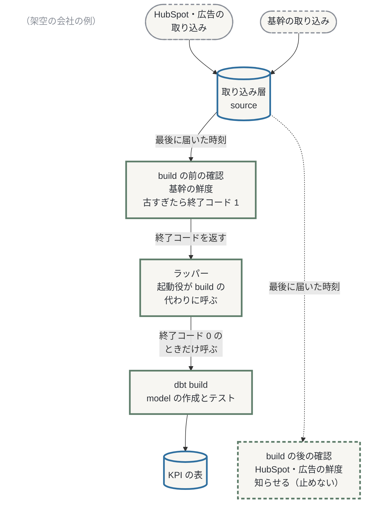
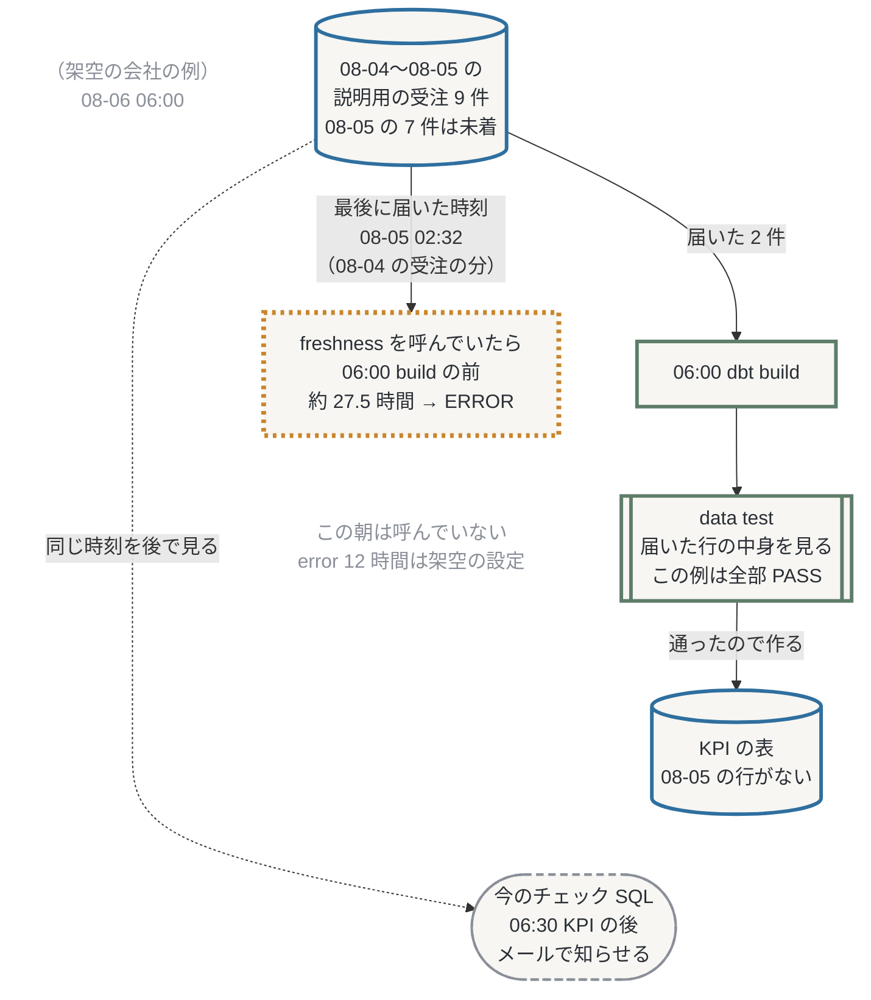
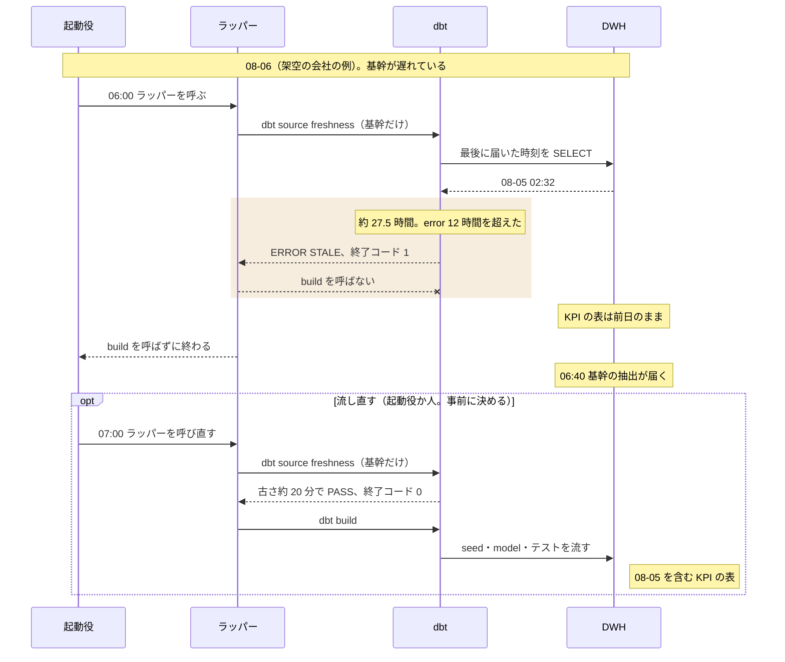
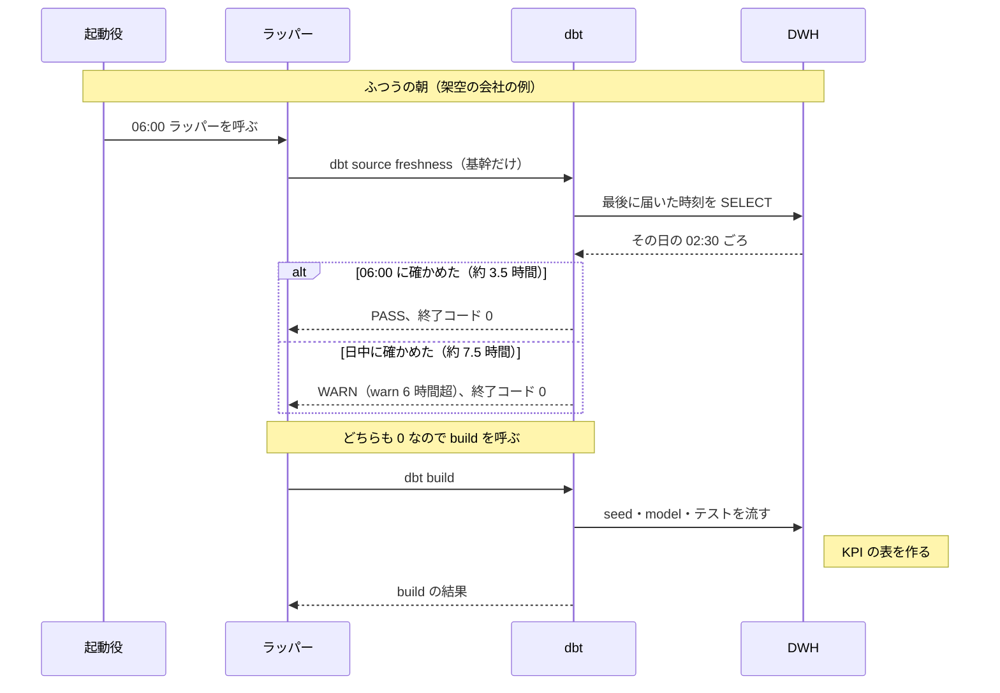
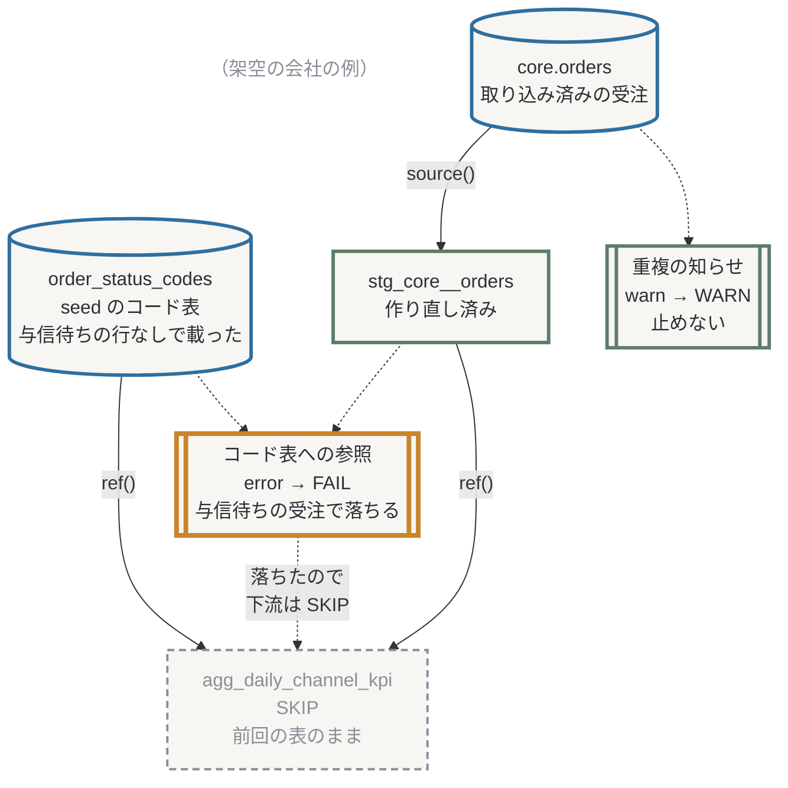

## 0. この記事について

**この章の問い**: この記事は誰向けで、読むと何が分かり、どのくらい時間がかかるか。

この記事は、データ基盤構築シリーズ dbt™ 編の 1話です。本編の 1 本目で、壊れたデータと遅れたデータを止めるか知らせる仕組み（data test、severity、source freshness）を扱います。0話（序章）では、dbt に移すと何が変わるかの全体像とハンズオンの環境を示しました。本編は、1話がテストと鮮度の確認、2話が突合と CI、3話が品質の監視、4〜5話がセマンティックレイヤー、6話（予定）が起動と運用です。この記事の中の区切りは「章」と呼びます。

**この記事の舞台**


舞台の図: 0話と同じ架空の会社の毎朝です。

この会社は、自家焙煎の豆や食品を、自社 EC（定期便を含む）・大手 EC モール 3 店・電話注文で売り、カフェなどへの卸もしています。あなたは、この会社のデータ基盤グループで、BigQuery にデータを集め、KPI を作る処理を保守している想定です。

毎日、前日の受注のデータが、夜間に基幹システムから BigQuery に届きます。CRM の HubSpot と、Google 広告・Meta 広告のデータも、夜間から早朝に届きます。06:00 から日次 KPI（チャネル別の受注件数や金額）を作り、06:30 にチェック SQL で数字を確かめます。09:00 の朝会で事業部が KPI を見るまでに、正しい KPI をそろえるのがあなたの仕事です。

日次 KPI を作るのは、スケジュールクエリとストアドです。スケジュールクエリは、決めた時刻に SQL を繰り返し流す BigQuery の機能です。この会社のストアド（ストアドプロシージャ）は、複数の SQL 文を束ねて名前を付け、BigQuery に保存したもので、呼び出すと中の文が上から順に流れます。今の作りでは、日次 KPI もチェック SQL も決めた時刻に動き、データの到着は待ちません。

1話で扱うのは、図の「データが届く」が遅れた朝です。KPI を作る処理は、0話のハンズオンと同じく dbt build（下の前提の用語）に移したものとします。「数字を確かめる」の一部は、dbt のテストと鮮度の確認に移します。

> 本シリーズでは、あるコーヒー・食品の大手通販（架空）を例に考えます。会社の設定と数字は説明のための架空のもので、実在の企業や、筆者の所属先・取引先とは関係ありません。文中の障害や設定ミスは架空の出来事で、各製品で実際に起きた障害を示すものではありません。EC プラットフォーム・広告媒体・CRM の製品名は実在のものですが、データはすべて合成したもので、実在のアカウントや顧客のデータは使っていません。各製品の仕様は 2026 年 10 月時点の公式情報にもとづきます。

**0話を読んでいない方へ**: 0話では、テストが全部通ったのに、取り込みの遅れで前日の行が欠けた KPI ができる朝を見ました。dbt build は鮮度を確かめないからです。ハンズオンの環境の準備は、[0話](https://zenn.dev/e8dev/articles/dbt-ep0-intro) の 4章か、この記事の 4章で案内するリポジトリの README にあります。

対象は、BigQuery のスケジュールクエリとストアドで毎朝の集計を回し、dbt を検討している方です。

**前提の用語**

| 用語 | 意味 |
|---|---|
| source | 取り込み済みの表をまとめて、YAML で dbt に宣言したもの。この記事では、取り込み元（本文の「ソース」）ごとに 1 つ置きます |
| model | 主に SELECT 文を 1 つ書いた .sql ファイルで、dbt が表やビューにする |
| dbt build | model の作成とテストを依存の順に行う |
| data test（データテスト） | 表の行が満たすべき条件（例: 受注番号が重複しない、空でない）を確かめる |
| source freshness（ソース フレッシュネス） | 取り込み時刻で source の鮮度を確かめる（以下 freshness） |
| severity（セベリティ） | テストが落ちたとき、下流を止める（既定）か知らせるだけか |

**先に結論（3 つ）**

1. 使いどころ: 遅れたら KPI の作成を止めたいソースは build の前、知らせるだけのソースは build の後か別のジョブで、鮮度を確かめます。
2. メリット: freshness は、許す古さ（しきい値）を、source を定義する YAML にソースごとに書けます。build の前に呼べば、error のしきい値を超えたときに終了コード 1 を返すので、欠けた KPI を作る前に気づけます。
3. 限界: freshness 自身は build を止めず、止めるのは終了コードを見る呼び出し側で、この記事ではラッパー（下の図 0）です。また、freshness が PASS でも、届いた数字が確定したとは限りません（5章の問い 7）。


図 0: ラッパーは freshness と build を順に呼ぶスクリプトで、終了コード 0 のときだけ build を呼びます。起動役（cron や Apache Airflow など、dbt build を呼ぶもの。2章）がラッパーを呼びます。

**読み方**

- 1〜6章は「この章の問い」で始まり、「この章の要点」で終わります。
- 「あなたの現場では」の枠は、今のやり方との対応です。
- 概要だけなら、0・1・2・6章を読みます。
- 運用を設計するなら、加えて 3・5章を読みます。
- 手を動かすなら、さらに 4章を読みます。
- 見込みは、読むのに約 29 分、手を動かすのに 45 分です。解説動画は 6章に置きます（準備中）。

**動作確認環境（2026-10-04〜05）**: Windows 11（PowerShell 5.1、Git Bash）、Python 3.12、uv 0.12.18。dbt-core 1.12.5、dbt-duckdb 1.11.0、dbt のパッケージ dbt_utils 1.4.1。DB は BigQuery の代わりに、PC の中で動く DuckDB 1.5.6 です。

**筆者について**: BigQuery を中心に、dbt を 2 年使ってきました。

## 1. freshness のメリットは何か — 今のチェックと何が違うのか

**この章の問い**: freshness は、今のチェック SQL や data test と何が違うのか。

:::message
**あなたの現場では**: 最終取り込み時刻のチェック SQL は source freshness に、件数・重複・コード値のものは data test になります。
:::

筆者も、freshness の使いどころとメリットが分かっていませんでした。

この会社（架空）の 08-06 は、06:00 に KPI を作った後、06:40 に基幹の抽出が届きました。06:30 のチェック SQL は遅れに気づきましたが、KPI の後で、毎朝届く約 40 通のチェックのメールに埋もれた 1 通でした。0話のハンズオンでこの朝を再現すると、build はテストが全部通ったまま、08-05 の行がない KPI を作りました（08-04 の件数も減りました）。

data test は、届いて表にある行が条件を満たすかを確かめます。行の欠けやデータの古さは、それを確かめるテスト（下の補足の recency など）を書かなければ見ません。source freshness は、取り込み時刻の列の最大値と確かめた時刻（今）の差を、warn と error のしきい値と比べます。


図 1: 08-04〜08-05 の説明用の受注 9 件のうち、06:00 に届いたのは 2 件で、この例のテストは全部 PASS します。freshness を build の前に呼んでいたら ERROR でした。

| | 今のチェック SQL | KPI の前に移したチェック（仮の案） | freshness（build の前） |
|---|---|---|---|
| 判定する時刻 | KPI の後（06:30） | KPI の前 | KPI の前 |
| 止められるか | 止められない | 止められる（作りは現場ごと） | 終了コードを返す。止めるのはそれを見るラッパー |
| しきい値の場所 | SQL の中 | SQL の中 | source を定義する YAML に、ソースごと |
| 結果 | メール | 現場ごと | 状態（PASS・WARN・ERROR）、終了コード、結果のファイル |

表の「判定する時刻」の違いは、freshness を呼ぶ位置（build の前）から来ます。ただ、止めること自体は、チェックを KPI の前に移しても作れます。それと比べた dbt の得は、しきい値が source を定義する YAML にそろい、表ごとに上書きできることです。対象のソースを選ぶオプション `--select` で、止めるソースと知らせるソースを分けて呼べ、結果は全ソースで同じ形で返ります。

:::details 補足: 古さを見るテスト（recency）との違い
dbt_utils の recency は、時刻の列の最大値が決めた期間より古いと失敗する data test です。source に付ければ、build の中でその source を読む model の前に判定され、error ならその下流だけが止まります（試していません）。その止め方でよければ recency が合います。次のどれかなら freshness です（筆者の判断）。

- build の前に丸ごと止める
- build の後に知らせる
- warn と error の 2 段で分ける
:::

ただし、取り込み時刻の列で確かめる freshness が見るのは最新の 1 時刻だけです。一部の行の遅れや、後から届く受注などで変わる数字は分かりません（5章の問い 7）。一部だけ届くデータには、判定を自分で書く道を公式は挙げています（試していません）。

### 確認問題 1

この章の 08-06 06:00 の朝について答えてください。(1) 重複・空・コード値のような、届いた行の中身を見るテストを足せば気づけたか。(2) 06:30 のチェック SQL と freshness は何が違うか。(3) freshness の設定（しきい値）を書けば、06:00 の build は止まったか。

:::details 答え
(1) 行の中身を見るテストを足すだけでは気づけません。欠けや古さには、そう書いたテストが要ります。(2) どちらも最新の取り込み時刻を見ます。チェック SQL は KPI の後に知らせ、freshness は build の前に呼べば KPI の前に判定して終了コードで返します。しきい値は、チェック SQL では SQL の中、freshness では source を定義する YAML に書きます。(3) 止まりません。build の前に freshness を呼び、終了コードで止める手順が要ります。
:::

**この章の要点**: build の前に呼んだ freshness は、行の中身を見るテストが見ない遅れを KPI の前に判定し、error なら終了コード 1 を返します。

## 2. freshness の使いどころはどこか — 置き場所としきい値

**この章の問い**: freshness を朝のジョブのどこに置き、しきい値をどう決めるのか。

:::message
**あなたの現場では**: シェルの `$?` で後続を分ける形は、dbt ではラッパーになります。起動時刻をずらす代わりに、ラッパーが freshness の終了コードで build を呼ぶかを決めます。
:::

### どこに置くか

freshness は、決まった間隔で届き、取り込み時刻の列がある取り込み層の表に付けるのがよいと筆者は考えます。更新の少ないマスタは `freshness: null` で外します（試していません）。列がない表は、取り込みで列を足すか、外します。BigQuery なら、列を指定せずに、表の最終更新時刻で判定させる道もあります（行の時刻ではありません。試していません）。

| | error のとき | warn のとき | 止めるのは |
|---|---|---|---|
| data test | 参照する表をすべて使う下流を SKIP | 止めない | dbt build |
| source freshness | 終了コード 1 を返す | 終了コード 0 | 呼ぶ側 |

build の前の確認は、止めたいソースだけを `--select` で絞って呼び、終了コードが 0 でなければ build を呼びません。止めないソースを混ぜると、それらが error を超えた朝に KPI まで止まるので、build の後か別のジョブで呼びます。結果の sources.json（表ごとの経過と状態が入るファイル）は通知に回します。

### しきい値の決め方

| 置き方 | 効くしきい値 | 決め方 |
|---|---|---|
| build の前の確認 | error だけ | ふつうの朝の古さと、届かなかった朝の古さの間 |
| build の後の確認 | warn と error | error は到着の間隔＋許せる遅れ。warn は遅れ始めを知らせる位置 |

たとえば、この会社の基幹（ふだん 02:30 ごろ着）を 06:00 に確かめます。前日の到着（02:30 ごろ）がふつうなら、古さは、当日の分が届いた朝で約 3.5 時間、届かない朝で 27 時間以上です。その間のどこに error を置いても判定は同じで、warn 6 時間は鳴りません。

:::details 補足: build の後の確認の頻度と例、表ごとの上書き
公式は、鮮度の確認を最も短い SLA（いつまでに届くべきかの約束）の 2 倍以上の頻度で流すよう勧めます（SLA が 1 日なら 12 時間ごと）。この会社は目安より少なく、06:10 に 1 回だけです（build が 10 分で終わる前提）。

計算すると、届いていない朝の 06:10 は、HubSpot（02:15 着）が約 27.9 時間で ERROR です。広告は約 24.5〜24.8 時間で WARN です。

目安どおり日中にも確かめると、毎日届く表は午後に warn 12 時間を超え、毎日鳴ります。その場合は warn を 24 時間より上に置き直します。

表で上書きするなら、warn_after と error_after の両方を書きます。書かなかった方は source の値を引き継ぐためです（試していません）。
:::

### 書き方

source の `config:` に、取り込み時刻の列（loaded_at_field）としきい値（warn_after・error_after）を書きます。しきい値には count と period の両方が要ります。

```yaml:models/staging/core/_core__sources.yml（1〜11 行目）
sources:
  - name: core
    description: 基幹（受注管理）。夜間バッチの抽出ファイルを bq load で取り込んだもの（ハンズオンでは scripts/load_duckdb.py が ec_raw に載せる）。
    schema: ec_raw
    config:
      # 1話: 基幹は通常 02:30 に届く。06:00 に build の前で確かめ、12 時間を超えていたら error（ラッパーが build を呼ばない）。
      # freshness は実際の今の時刻と比べるので、ロードに --replay を付け、ロードの直後に確かめる
      loaded_at_field: _loaded_at
      freshness:
        warn_after: { count: 6, period: hour }
        error_after: { count: 12, period: hour }
```

`- name: core` が基幹の source で、表はこの下に並び、ここの設定が全表に効きます。

### 起動役と dbt platform

:::details 自前と dbt platform のジョブの違い
公式は dbt platform（旧 dbt Cloud）のジョブについて、古いときに model を走らせたくないなら最初の手順に置く案を挙げています。そうでなければ、最後の手順か別のジョブを勧めています。

| | 自前（ラッパー） | dbt platform のジョブ（2026-10-04 確認） |
|---|---|---|
| 止める | 終了コードで build を呼ばない | コマンドの手順として最初に置く（鮮度のチェックボックスでは止まらない） |
| 知らせる | sources.json を通知に回す | 最後の手順か別のジョブ。状態を画面で見られる |

:::

スケジュールクエリだけで回しているなら、dbt を呼ぶ起動役を先に決めます。候補は、公式が案内する Apache Airflow や cron などの外の道具と、上の dbt platform（旧 dbt Cloud）のジョブです。組み方は 6話（予定）で扱います。起動役があれば増やさず、呼ぶ先を build からラッパーに替えます（図 0）。

:::details 補足: JP1 などで到着を待ってから流してきた方へ
ファイルの到着や先行ジョブの終了を待ってから後続を流していたなら、そこが違います。dbt は呼ばれた時刻に動き、freshness は呼ばれた時点の古さを返すだけです。待つ仕組みは、ジョブ管理の側に残ります。
:::

**この章の要点**: 止めたいソースは build の前に error で、止めないソースは build の後に warn と error で、鮮度を確かめます。

## 3. 架空の通販の朝では、何を止めて、何を知らせるか

**この章の問い**: 架空の通販の朝で、どのソースを止め、どの故障にどの検査を当てるのか。

:::message
**あなたの現場では**: コード値マスタと突き合わせるチェック SQL は、seed のコード表への relationships になります。
:::

### ソースごとの約束

| ソース | ふつうの到着 | 置き方 | 確かめる時刻 | warn | error |
|---|---|---|---|---|---|
| 基幹 | 02:30 | build の前（止める） | 06:00 | 6 時間 | 12 時間 |
| HubSpot、Google 広告、Meta 広告 | 02:15、05:40、05:20 | build の後（知らせる） | 06:10 | 12 時間 | 26 時間 |

しきい値は推奨値ではなく、この会社の設定です。基幹は朝会の KPI の元なので止め、HubSpot と広告は止めると基幹の KPI まで前日のままになるので知らせるだけにします。

### 故障ごとのテストの割り当て

何を検査するかは、故障ごとに決めます。0話で触れたとおり、筆者も dbt の導入後に、テストが十分でなくデータが一時的に不整合になったことがあります。この会社では 07-21 の基幹の改修で、受注の状態に「与信待ち」が加わりました。

| 故障 | テスト（severity） | 置き場所 | 直し方 |
|---|---|---|---|
| 新しいコード値（与信待ち） | コード表への relationships（error） | staging | コード表に 1 行足す |
| モール受注の二重取り込み（09-08） | unique_combination_of_columns（warn） | source | staging で除く |
| 基幹の遅れ | source freshness | build の前 | 届いた後に流し直す |
| 受注番号の重複・空 | unique、not_null（error） | staging | 0話からある |

seed（シード）は、リポジトリの CSV を表にする仕組みで、公式は変わることの少ない対応表のようなデータに向くとしています。relationships は、子の行に対応する行が親の表にあるかを確かめ、NULL は見ません。コード表に与信待ちを足すとき、受注に数えるか（キャンセル扱いにするか）は経営企画部が決めます。

unique_combination_of_columns は dbt_utils のテストで、2 行以上ある列の組を返します。where で対象を絞れます（書き方は 4-2）。

### 確認問題 2

「ソースごとの約束」の表について答えてください。(1) 基幹の warn 6 時間は 06:00 の確認で鳴るか。(2) HubSpot と広告に warn は要るか。(3) 全部を build の前で止めると何が起きるか。

:::details 答え
置き方によって効くしきい値が違うことを説明できれば正解です。

- (1) 鳴りません。前日の到着がふつうなら、06:00 の古さは約 3.5 時間か 27 時間以上で、効くのは error だけです。06:00 の 1 回の確認では、基幹の warn は働きません。
- (2) 広告には要ります。届いていない朝の 06:10 でも広告は error 26 時間に届かず、warn がないと遅れが知らされません。06:10 の 1 回の確認で warn が働くのは広告で、HubSpot は error で分かります。
- (3) HubSpot や広告が error を超えた朝は終了コードが 1 になり、届いた基幹の KPI まで前日のままになります。

:::

**この章の要点**: 基幹は build の前で止めて HubSpot と広告は後で知らせ、故障は数字を壊すなら error、そのまま使えるなら warn にします。

## 4. ハンズオン — build の前の確認、止まるテスト、知らせるテスト

**この章の問い**: 遅れた朝と故障を入れたデータで、freshness とテストはどう反応し、どう直すのか。

:::message
**あなたの現場では**: 止めるチェック SQL と、メールで知らせるだけのチェック SQL は、severity の error と warn になります。
:::

### 構成と準備

ハンズオンはタグ ep1-end を使います。

https://github.com/e8dev-note/ec-analytics-handson/tree/ep1-end

0話の ep0-end からの差は次のとおりで、A は足したファイル、M は変えたファイルです。

```text
M	.github/workflows/ci.yml
M	README.md
M	dbt_project.yml
M	docs/dataform-vs-dbt.md
M	expected/s__clean__2026-10-01.json
M	expected/xs__clean__2026-10-01.json
M	models/marts/_marts.yml
M	models/marts/agg_daily_channel_kpi.sql
M	models/staging/core/_core__models.yml
M	models/staging/core/_core__sources.yml
M	models/staging/core/stg_core__orders.sql
A	models/staging/gads/_gads__sources.yml
A	models/staging/hubspot/_hubspot__sources.yml
A	models/staging/meta/_meta__sources.yml
A	package-lock.yml
A	packages.yml
A	scripts/build_if_fresh.ps1
A	scripts/build_if_fresh.sh
A	scripts/show_freshness.py
A	seeds/_seeds.yml
A	seeds/order_status_codes.csv
```

:::details 足したファイルの役割
| ファイル | 役割 |
|---|---|
| seeds/order_status_codes.csv | 状態のコード表 |
| scripts/build_if_fresh.ps1・.sh | ラッパー |
| scripts/show_freshness.py | 遅れている表の表示 |
| _hubspot・_gads・_meta__sources.yml | 知らせるソースの鮮度 |

:::

0話で clone 済みなら、git clone の代わりにそのフォルダで次を打ちます。

```powershell
git status --short
```

何か表示されたら、README の「0話で clone 済みの場合」の戻し方で戻します。次にタグを取ります。タグがまだない clone では、次のような表示が出ます。

```powershell
git fetch --tags
```

```text
From https://github.com/e8dev-note/ec-analytics-handson
 * [new tag]         ep1-end    -> ep1-end
```

続けて、下の `git checkout ep1-end` から進めます。

PowerShell、Git Bash の順に載せます。Git Bash では、ラッパーの行を 4-1 (a) の形に、`"exit=$LASTEXITCODE"` を `echo "exit=$?"` に読み替えます。

```powershell
git clone https://github.com/e8dev-note/ec-analytics-handson.git
cd ec-analytics-handson
git checkout ep1-end
uv sync

$env:PYTHONUTF8 = "1"
$env:DO_NOT_TRACK = "1"
$env:DBT_SEND_ANONYMOUS_USAGE_STATS = "False"

uv run dbt deps
```

```bash
git clone https://github.com/e8dev-note/ec-analytics-handson.git
cd ec-analytics-handson
git checkout ep1-end
uv sync

export PYTHONUTF8=1 DO_NOT_TRACK=1 DBT_SEND_ANONYMOUS_USAGE_STATS=False

uv run dbt deps
```

```yaml:packages.yml
# dbt パッケージ（版は完全に固定する。dbt deps で dbt_packages/ に入り、版は package-lock.yml にも記録される）。
# dbt のパッケージは Python のパッケージ（uv.lock）とは別物で、uv sync では入らない。
packages:
  # 1話: generic test の unique_combination_of_columns（列の組が一意か）
  - package: dbt-labs/dbt_utils
    version: 1.4.1
```

合成データは、小さい規模 xs と 1話用の設定 ep1b で作ります。

```powershell
uv run python -m generator --scale xs --preset ep1b
```

:::details つまずき: dbt deps を忘れたとき、プロキシで通らないとき
dbt deps を忘れて dbt build を流すと、dbt はプロジェクトを読み込む前に止まり、この環境では終了コードは 2 でした。

```text
（前略: 版の表示）
13:55:06  [ERROR]: Encountered an error:
Compilation Error
  dbt expects 1 package(s) based on packages specified in packages.yml, but found only 0 package(s) installed in dbt_packages. Following packages were not found: dbt_utils. Run "dbt deps" to install package dependencies.
```

dbt deps の接続先は hub.getdbt.com と codeload.github.com でした（2026-10-04 時点）。プロキシで通らないあいだは、README の「dbt deps が通らないとき」で、dbt_utils の 2 つのテストを外して 4-1 を試せます。PYTHONUTF8 がないときのエラーは 0話の 4章のとおりです。
:::

### 4-1. 遅れた朝の build の前の確認

**(a0) build だけを流す**。08-06 06:00 の状態を、取り込み時刻を今に合わせてずらす `--replay` 付きで載せます。

```powershell
uv run python scripts/load_duckdb.py --reset-db --as-of 2026-08-06T06:00+09:00 --replay
uv run dbt build
```

```text
（前略: 版の表示と 20 ノードの行）
16:25:16  Completed successfully
16:25:16  
16:25:16  Done. PASS=20 WARN=0 ERROR=0 SKIP=0 NO-OP=0 REUSED=0 TOTAL=20
```

```powershell
uv run dbt show --inline "select kpi_date, sum(order_count) as orders from {{ ref('agg_daily_channel_kpi') }} where kpi_date >= '2026-08-03' group by kpi_date order by kpi_date"
```

```text
（前略: 実行の表示）
|   kpi_date | orders |
| ---------- | ------ |
| 2026-08-03 |    137 |
| 2026-08-04 |    108 |
```

テストは全部通りますが、KPI に 08-05 の行がありません。全ソースの freshness では、基幹の 2 表だけが ERROR STALE で、終了コードは 1 です。

```powershell
uv run dbt source freshness; "exit=$LASTEXITCODE"
```

```text
（前略: 版の表示。START の行はすべて省いた）
16:25:24  1 of 6 ERROR STALE freshness of core.order_lines ............................... [ERROR STALE in 0.02s]
16:25:24  2 of 6 ERROR STALE freshness of core.orders .................................... [ERROR STALE in 0.03s]
16:25:24  3 of 6 PASS freshness of gads.campaign_daily ................................... [PASS in 0.03s]
16:25:24  4 of 6 PASS freshness of hubspot.contacts ...................................... [PASS in 0.03s]
（中略: HubSpot のメールイベントと Meta 広告も PASS。error の表の一覧）
16:25:24  Done.
exit=1
```

経過時間はコンソールに出ないので、結果の表示で見ます。

```powershell
uv run python scripts/show_freshness.py
```

```text
target/sources.json: 2026-10-04T16:25:24.385890Z (UTC) の結果。6 表のうち、遅れている表 2
  ERROR  core.order_lines                 最新の取り込み 2026-10-03T12:57:10+00:00（27.5 時間前）  warn 6 時間 / error 12 時間
  ERROR  core.orders                      最新の取り込み 2026-10-03T12:57:10+00:00（27.5 時間前）  warn 6 時間 / error 12 時間
```

表示の時刻はずらした後のもので、27.5 時間が 08-06 06:00 の古さです。


図 2: 06:00 の freshness が終了コード 1 を返すと、ラッパーは build を呼びません。届いた後に、起動役か人が呼び直します。

**(a) ラッパーで止める**。中身は次の数行です。

```powershell:scripts/build_if_fresh.ps1（12〜20 行目）
uv run dbt source freshness --select source:core
$code = $LASTEXITCODE
if ($code -ne 0) {
    Write-Output "[build_if_fresh] source:core is not fresh (exit $code). dbt build was not called."
    exit $code
}
Write-Output "[build_if_fresh] source:core is fresh enough (exit 0). Calling dbt build."
uv run dbt build @args
exit $LASTEXITCODE
```

前の朝（08-05 06:00）を載せて呼ぶと、build が走ります。

```powershell:PowerShell
uv run python scripts/load_duckdb.py --reset-db --as-of 2026-08-05T06:00+09:00 --replay
powershell -NoProfile -ExecutionPolicy Bypass -File scripts\build_if_fresh.ps1; "exit=$LASTEXITCODE"
```

```bash:Git Bash
uv run python scripts/load_duckdb.py --reset-db --as-of 2026-08-05T06:00+09:00 --replay
bash scripts/build_if_fresh.sh; echo "exit=$?"
```

```powershell
uv run dbt show --inline "select max(kpi_date) as latest_kpi_date, count(*) as kpi_rows from {{ ref('agg_daily_channel_kpi') }}"
```

```text
（前略: 実行の表示）
| latest_kpi_date | kpi_rows |
| --------------- | -------- |
|      2026-08-04 |      474 |
```

KPI の最新の日付は 08-04 です。前の朝の KPI の表を残すため、続けて `--reset-db` を付けずに 08-06 06:00 を載せ、もう一度呼びます。

```powershell
uv run python scripts/load_duckdb.py --as-of 2026-08-06T06:00+09:00 --replay
```

```powershell
powershell -NoProfile -ExecutionPolicy Bypass -File scripts\build_if_fresh.ps1; "exit=$LASTEXITCODE"
```

```text
（前略: 版の表示と START の行）
16:25:44  1 of 2 ERROR STALE freshness of core.order_lines ............................... [ERROR STALE in 0.01s]
16:25:44  2 of 2 ERROR STALE freshness of core.orders .................................... [ERROR STALE in 0.02s]
（中略: error の表の一覧）
[build_if_fresh] source:core is not fresh (exit 1). dbt build was not called.
exit=1
```

```powershell
uv run dbt show --inline "select max(kpi_date) as latest_kpi_date, count(*) as kpi_rows from {{ ref('agg_daily_channel_kpi') }}"
```

```text
（前略: 実行の表示）
| latest_kpi_date | kpi_rows |
| --------------- | -------- |
|      2026-08-04 |      474 |
```

ラッパーは build を呼ばずに終了コード 1 で終わり、KPI は前日のまま残ります。

**(b) 届いた後に呼び直す**。07:00 の状態で呼び直すと、基幹は古さ約 20 分で PASS し、build が走って 08-05 の行ができます。

```powershell
uv run python scripts/load_duckdb.py --as-of 2026-08-06T07:00+09:00 --replay
powershell -NoProfile -ExecutionPolicy Bypass -File scripts\build_if_fresh.ps1; "exit=$LASTEXITCODE"
```

```powershell
uv run dbt show --limit 10 --inline "select * from {{ ref('agg_daily_channel_kpi') }} where kpi_date = '2026-08-05' order by channel_code"
```

```text
（前略: 実行の表示）
|   kpi_date | channel_code | order_count | order_amount_gross |
| ---------- | ------------ | ----------- | ------------------ |
| 2026-08-05 | B2B_QUOTE    |           2 |             142150 |
| 2026-08-05 | B2B_WEB      |           6 |             157380 |
| 2026-08-05 | MALL_A       |           7 |              23650 |
| 2026-08-05 | MALL_B       |           4 |              12390 |
| 2026-08-05 | MALL_C       |           2 |               9010 |
| 2026-08-05 | PHONE        |           5 |              13640 |
| 2026-08-05 | SUBSCRIPTION |          46 |             156963 |
| 2026-08-05 | WEB          |         100 |             526670 |
```


図 3: 日中に確かめた WARN でも終了コードは 0 なので、ラッパーは build を呼びます。

:::details (c) 日中に確かめると WARN でも build が走る
08-05 10:00 の状態では、基幹は約 7.5 時間で WARN ですが、終了コードは 0 で build が呼ばれます。

```powershell
uv run python scripts/load_duckdb.py --as-of 2026-08-05T10:00+09:00 --replay
powershell -NoProfile -ExecutionPolicy Bypass -File scripts\build_if_fresh.ps1; "exit=$LASTEXITCODE"
```

```powershell
uv run python scripts/show_freshness.py
```

```text
target/sources.json: 2026-10-04T16:26:08.875380Z (UTC) の結果。2 表のうち、遅れている表 2
  WARN   core.order_lines                 最新の取り込み 2026-10-04T08:58:03+00:00（7.5 時間前）  warn 6 時間 / error 12 時間
  WARN   core.orders                      最新の取り込み 2026-10-04T08:58:03+00:00（7.5 時間前）  warn 6 時間 / error 12 時間
```
:::

**(d) build の後の確認**。HubSpot と広告の 4 表を `--replay` なしで載せ、取り込みが何日も止まった状態の代わりにします。ラッパーは基幹だけを見るので、build が走ります。その後に 4 表を確かめると、広告も ERROR STALE です。

```powershell
uv run python scripts/load_duckdb.py --as-of 2026-08-06T07:00+09:00 --tables hubspot__contacts,hubspot__email_events,gads__campaign_daily,meta__campaign_insights_daily
uv run python scripts/load_duckdb.py --as-of 2026-08-06T07:00+09:00 --replay --tables core__orders,core__order_lines
powershell -NoProfile -ExecutionPolicy Bypass -File scripts\build_if_fresh.ps1; "exit=$LASTEXITCODE"
```

```powershell
uv run dbt source freshness --select source:hubspot source:gads source:meta
```

```text
（前略: 版の表示と START の行）
16:26:26  1 of 4 ERROR STALE freshness of gads.campaign_daily ............................ [ERROR STALE in 0.03s]
16:26:26  2 of 4 ERROR STALE freshness of hubspot.contacts ............................... [ERROR STALE in 0.03s]
16:26:26  3 of 4 ERROR STALE freshness of hubspot.email_events ........................... [ERROR STALE in 0.03s]
16:26:26  4 of 4 ERROR STALE freshness of meta.campaign_insights_daily ................... [ERROR STALE in 0.03s]
（後略: error の表の一覧）
```

KPI は作られた後なので止まりません。

:::details 補足: 試すときの注意と、ほかの呼び方

- ロードから時間を置くと、その分だけ古く判定されます。
- 確認に使った PC では、.ps1 は `-ExecutionPolicy Bypass` なしで読み込めませんでした。この指定を使えないときは、(a) の Git Bash 版で確かめます。
- 終了コードでは WARN と正常を区別できず、1 は権限の不足などでも返ります。WARN で止めたいなら、sources.json の状態を読みます（試していません）。
- sources.json は実行ごとに上書きされ、推移は残りません。
- 前回の結果（`--state`）と比べ、新しいデータが届いた source の下流を選ぶ `source_status:fresher+` もあります（試していません。6話で扱う予定）。
:::

### 4-2. コード表の欠けと severity

4-2 と 4-3 は 10-01 の状態で行います。時刻の指定（`--as-of`）を付けずに載せ直してから build します。

```powershell
uv run python scripts/load_duckdb.py
uv run dbt build
```

```powershell
uv run dbt show --inline "select count(*) as kpi_rows, sum(order_count) as orders, sum(order_amount_gross) as amount from {{ ref('agg_daily_channel_kpi') }}"
```

```text
（前略: 実行の表示）
| kpi_rows | orders |   amount |
| -------- | ------ | -------- |
|      894 |  17829 | 99975718 |
```

build は PASS=18 WARN=2 で、WARN は止まりません。1 つは明細から受注への relationships（22 件）で、0話から warn にしてあります。もう 1 つは source の重複（10 組）で、下がその定義です。

```yaml:models/staging/core/_core__sources.yml（13〜23 行目）
      - name: orders
        identifier: core__orders
        description: 受注ヘッダ（as-of の時点の状態。状態は上書きされ、履歴は残らない）。
        data_tests:
          # 1話: モール受注の手での再取り込み（二重計上）を取り込み層で知らせる。重複は staging で除くので warn にとどめる
          - dbt_utils.unique_combination_of_columns:
              arguments:
                combination_of_columns: [channel_code, mall_order_no]
              config:
                where: "mall_order_no is not null"
                severity: warn
```

コード表から ON_HOLD_CREDIT（与信待ち）の行をエディタで消して改修の前の形にし、git diff で確かめてから build します。

```powershell
git diff seeds/order_status_codes.csv
```

```text
diff --git a/seeds/order_status_codes.csv b/seeds/order_status_codes.csv
index 23b830d..3db3c89 100644
--- a/seeds/order_status_codes.csv
+++ b/seeds/order_status_codes.csv
@@ -1,6 +1,5 @@
 status_code,label_ja,is_cancelled,sort_order
 RECEIVED,受付,false,10
-ON_HOLD_CREDIT,与信待ち（後払い）,false,15
 ALLOCATED,引当済み,false,20
 PARTIALLY_SHIPPED,一部出荷,false,30
 SHIPPED,出荷済み,false,40
```

```yaml:models/staging/core/_core__models.yml（22〜31 行目）
      - name: order_status
        description: 受注の状態（seed order_status_codes のコード）
        data_tests:
          - not_null
          # 1話: コード表にない状態が来たら止める（severity の指定なし = error）。
          #      コード表を参照する agg_daily_channel_kpi は作られず（SKIP）、前回の表のまま残る
          - relationships:
              arguments:
                to: ref('order_status_codes')
                field: status_code
```


図 4: コード表と stg_core__orders は作り直され、止まる（SKIP）のは両方を参照する KPI だけです。warn のテストは止めません。

```powershell
uv run dbt build; "exit=$LASTEXITCODE"
```

```text
（前略: 版の表示と START の行）
16:26:45  3 of 20 WARN 10 dbt_utils_source_unique_combination_of_columns_core_orders_channel_code__mall_order_no  [WARN 10 in 0.09s]
（中略）
16:26:45  2 of 20 OK loaded seed file ec.order_status_codes .............................. [INSERT 6 in 0.09s]
（中略）
16:26:45  4 of 20 OK created sql view model ec_staging.stg_core__orders .................. [OK in 0.06s]
（中略: PASS のテスト）
16:26:45  17 of 20 WARN 22 relationships_stg_core__order_lines_order_no__order_no__ref_stg_core__orders_  [WARN 22 in 0.06s]
16:26:45  18 of 20 FAIL 13 relationships_stg_core__orders_order_status__status_code__ref_order_status_codes_  [FAIL 13 in 0.06s]
（中略）
16:26:45  20 of 20 SKIP relation ec_marts.agg_daily_channel_kpi .......................... [SKIP]
（中略: error と warning の詳細）
16:26:46  Done. PASS=16 WARN=2 ERROR=1 SKIP=1 NO-OP=0 REUSED=0 TOTAL=20
exit=1
```

コード表への relationships が FAIL（13 件）になり、終了コードは 1 です。KPI は SKIP で前回の表のまま残り、件数と金額も壊す前と同じです。

```powershell
uv run dbt show --inline "select count(*) as kpi_rows, sum(order_count) as orders, sum(order_amount_gross) as amount from {{ ref('agg_daily_channel_kpi') }}"
```

```text
（前略: 実行の表示）
| kpi_rows | orders |   amount |
| -------- | ------ | -------- |
|      894 |  17829 | 99975718 |
```

行を戻して build すると、PASS=18 WARN=2 に戻ります。

```powershell
git restore seeds/order_status_codes.csv
uv run dbt build
```

:::details warn にしていたら
relationships を warn にして壊すと、build は終了コード 0 で KPI を作り直します。コード表にない状態の受注 13 件（記録から数えると 55,507 円）は、黙って抜けます。下の出力は、README の「1話のもう一歩」の手順を別に試した記録です。

```text
（前略）
13:58:13  18 of 20 WARN 13 relationships_stg_core__orders_order_status__status_code__ref_order_status_codes_  [WARN 13 in 0.06s]
（中略）
13:58:13  20 of 20 OK created sql table model ec_marts.agg_daily_channel_kpi ............. [OK in 0.10s]
（中略）
13:58:13  Done. PASS=17 WARN=3 ERROR=0 SKIP=0 NO-OP=0 REUSED=0 TOTAL=20
```

KPI がコード表を inner join し、キャンセルの印で除いているからです。

```sql:models/marts/agg_daily_channel_kpi.sql（抜粋）
（前略: status_codes の CTE）
orders as (

    select
        stg.order_no,
        stg.order_date,
        stg.channel_code,
        stg.shipping_fee_incl_tax
    from {{ ref('stg_core__orders') }} as stg
    inner join status_codes
        on stg.order_status = status_codes.status_code
    where not status_codes.is_cancelled

),
（後略: lines の CTE と日 × チャネルの集計）
```
:::

### 4-3. 重複を除いた結果

```powershell
uv run dbt show --inline "select 'source' as layer, count(*) as orders, count(*) - count(mall_order_no) as no_mall_order_no from {{ source('core', 'orders') }} union all select 'staging', count(*), count(*) - count(mall_order_no) from {{ ref('stg_core__orders') }} order by layer"
```

```text
（前略: 実行の表示）
| layer   | orders | no_mall_order_no |
| ------- | ------ | ---------------- |
| source  |  18590 |            13776 |
| staging |  18580 |            13776 |
```

重複の 10 件だけが除かれます。ハンズオンの記録から数えると、4-2 の WARN 22 件は、この 10 件の明細で、KPI には入りません。残す 1 件が実行ごとに変わらないよう、並びを created_at と order_no で一意にしています。

```sql:models/staging/core/stg_core__orders.sql（11〜21 行目）
numbered as (

    select
        *,
        row_number() over (
            partition by channel_code, coalesce(mall_order_no, order_no)
            order by created_at, order_no
        ) as import_seq
    from source

)
```

```sql:models/staging/core/stg_core__orders.sql（44〜45 行目）
from numbered
where import_seq = 1
```

**この章の要点**: 遅れた朝はラッパーが build を呼ばず KPI は前日のまま残り、コード表にない値は error のテストが下流を止めます。

## 5. 運用の打ち合わせで聞かれること

**この章の問い**: 本番に入れる前の打ち合わせで何を聞かれ、どう答えるか。

**問い 1（上司）: dbt にしたら次は気づけるのか。テストを足せばよいのか**
行の中身を見るテストを足しても、届いていない朝には気づけません（古さを見るテストは 1章の補足）。止めたいソースの鮮度を build の前に確かめれば、欠けた KPI を作らずに済みます。

**問い 2（上司）: 今の最終取り込み時刻のチェックを、KPI の前に移すだけではだめか**
移せば止められ、変換を dbt に移さないならそれで足ります（筆者の判断）。dbt に移したときの得は 1章で比べました。

**問い 3（運用担当）: 約 300 本のチェック SQL と毎朝約 40 通のメールは減るのか**
減るのは最終取り込み時刻と、コード値・重複の数本だけで、しばらく並行して動かしてから、古いチェック SQL をやめます。鳴りすぎの整理は 3話です。

**問い 4（朝会の運営）: 基幹が遅れて止めた朝、09:00 の朝会には何が出るのか**
前日の KPI のままです（4-1 (a)）。取り違えないよう、画面に KPI の基準日か未着の注記を出します。誰が流し直すかと、09:00 までに届かないときの進め方は事前に決めます。6話（予定）で扱います。

**問い 5（マーケティング本部）: 知らせるだけの HubSpot や広告が遅れた朝、レポートはどうなるのか**
build は止まらないので、そのソースを使う数字は欠けたまま出ます。誰に何で知らせ、朝会でどう扱うかを決めておきます。

**問い 6（上司、経理）: 鮮度の確認に費用はかかるのか**
取り込み時刻の列で確かめるなら、鮮度の確認も DWH で流れる SELECT です。BigQuery のオンデマンド課金なら、処理したバイトで課金され、クエリが参照する表ごとに最低 10 MB です（2026-10-04 確認）。INFORMATION_SCHEMA.JOBS で 1 回分の処理量を見て、多ければ filter（確認のクエリに WHERE を付ける設定）で絞ります。減る量は表の作りによります。この記事の手順は、dbt platform なしの自前の dbt（dbt-core）で動かしました（製品ごとの費用は 0話の 2章）。

**問い 7（アナリスト）: freshness が全部緑なら、朝会の数字は確定しているのか**
確定とは限りません（1章）。ハンズオンでも、08-06 07:00 に PASS だったときの 08-05 は 172 件で、後から届いた受注などで 10-01 には 195 件でした。

### 確認問題 3

freshness がすべて緑の朝です。自社 EC は Shopify です。前日の (1) 受注の件数、(2) 注文の流入元（ジャーニー）の内訳、(3) メールの開封率を、確定の数字として朝会に出してよいでしょうか。

:::details 答え
どれも確定とは限りません。

- (1) 取り消しは後から届きます。図 1 の 08-05 の 7 件は、1 件が抽出の前に取り消し済みです。コード表に与信待ちを足した後なら、08-06 07:00 に 6 件、10-01 に 4 件と数えます。
- (2) Shopify の Admin API（2026-10 版）では、ジャーニーは、帰属のセッションが作られるまで ready が false です。
- (3) この会社では、開封は送信から 2〜3 日かけて積み上がります。

確定したかは、別の列か集計の条件で示します（作り方は 3話・4話）。
:::

**この章の要点**: 「次は気づけるのか」には、鮮度を build の前に確かめれば欠けた KPI を作らずに済む、と答えます。

## 6. まとめと次の一歩

**この章の問い**: 読み終えたら、自分の現場で何から始めるか。

まとめは 0章の「先に結論」の 3 つです。

### 持ち帰りキット

**(a) 自社で確かめること**

1. 取り込み層の表ごとに、取り込み時刻の列があるかと、タイムゾーン付きか（ない値は UTC とみなされ、日本時間だと約 9 時間甘く判定されます）
2. 表ごとの、ふつうの日といちばん遅かった日の到着の時刻
3. 朝のチェック SQL を「最終取り込み時刻」「件数・重複・コード値」「その他」に分けた本数

**(b) 聞く質問と相手**

- 止めた朝、前日の KPI で朝会を開いてよいか → EC 事業本部と経営企画部
- 止めた朝に、誰がいつ流し直すか → 運用担当と EC 事業本部
- HubSpot と広告の遅れを、誰に何で知らせるか → マーケティング本部
- dbt deps の通信先への接続を許可してもらえるか → 情報システム部
- 基幹のコード値を変える改修を、事前に知らせてもらえるか → 基幹の保守の委託先（SIer）

**(c) 自社で埋める表**

| ソース | 取り込み時刻の列 | 到着の間隔 | 確かめる時刻 | 止める / 知らせる | warn | error |
|---|---|---|---|---|---|---|
| | | | | | | |
| | | | | | | |
| | | | | | | |

**(d) 1 枚図**: 0章の図 0 です。

解説動画は準備中です。

### 次の一歩

次の 2話は、変更で壊さない仕組み（unit test、model contract、突合と CI）です。

:::details v2 ではこう変わる
dbt の次の版の v2（0話の 6章）では、source と model をまとめて確かめる dbt freshness が推奨されます。dbt source freshness も残ります。model の鮮度を warn_after・error_after で確かめる機能は v2 だけです。テストの引数は、この記事と同じ arguments: の下が必須になります。
:::

**この章の要点**: ソースごとに取り込み時刻の列・到着の間隔・止めるか知らせるかを表にし、止めるソースの鮮度を build の前で確かめます。

## 付録

### 用語マップ

| 語 | 位置づけ |
|---|---|
| dbt_utils | dbt deps で入れるテストなどのパッケージ |
| ERROR STALE | 鮮度の確認で error のしきい値を超えたときの表示 |
| filter | 鮮度の確認のクエリに WHERE を付け、読む範囲を絞る設定 |
| source_status:fresher+ | 新しいデータが届いた source の下流を選ぶ指定（6話で扱う予定） |

### 参考文献

確認日は 2026-10-04 です（Stored procedures・Schedule workloads・About dbt setup・What is dbt?・About dbt models・Materializations は 2026-10-05）。

- dbt docs: [What is dbt?](https://docs.getdbt.com/docs/introduction)、[About dbt models](https://docs.getdbt.com/docs/build/models)、[Materializations](https://docs.getdbt.com/docs/build/materializations)
- dbt docs: [Add sources to your DAG](https://docs.getdbt.com/docs/build/sources)、[freshness](https://docs.getdbt.com/reference/resource-configs/freshness)、[Source freshness](https://docs.getdbt.com/docs/deploy/source-freshness)、[About dbt source command](https://docs.getdbt.com/reference/commands/source)、[Sources JSON file](https://docs.getdbt.com/reference/artifacts/sources-json)、[Exit codes](https://docs.getdbt.com/reference/exit-codes)
- dbt docs: [About dbt build command](https://docs.getdbt.com/reference/commands/build)、[severity, error_if, and warn_if](https://docs.getdbt.com/reference/resource-configs/severity)、[Add data tests to your DAG](https://docs.getdbt.com/docs/build/data-tests)、[About data tests property](https://docs.getdbt.com/reference/resource-properties/data-tests)、[where](https://docs.getdbt.com/reference/resource-configs/where)
- dbt docs: [Add Seeds to your DAG](https://docs.getdbt.com/docs/build/seeds)、[column_types](https://docs.getdbt.com/reference/resource-configs/column_types)、[Packages](https://docs.getdbt.com/docs/build/packages)、[About dbt deps command](https://docs.getdbt.com/reference/commands/deps)、[Node selector methods](https://docs.getdbt.com/reference/node-selection/methods)、[About dbt freshness command](https://docs.getdbt.com/reference/commands/freshness)、[Integrate with other orchestration tools](https://docs.getdbt.com/docs/deploy/deployment-tools)、[About dbt setup](https://docs.getdbt.com/docs/about-setup)
- dbt_utils: [dbt Hub](https://hub.getdbt.com/dbt-labs/dbt_utils/latest/)、[README（1.4.1）](https://raw.githubusercontent.com/dbt-labs/dbt-utils/1.4.1/README.md)
- Google Cloud: [BigQuery pricing](https://cloud.google.com/bigquery/pricing)、[JOBS view](https://docs.cloud.google.com/bigquery/docs/information-schema-jobs)、[Scheduling queries](https://docs.cloud.google.com/bigquery/docs/scheduling-queries)、[Stored procedures](https://docs.cloud.google.com/bigquery/docs/procedures)、[Schedule workloads](https://docs.cloud.google.com/bigquery/docs/orchestrate-workloads)、[Numbering functions](https://docs.cloud.google.com/bigquery/docs/reference/standard-sql/numbering_functions)、[REST Resource: tables](https://docs.cloud.google.com/bigquery/docs/reference/rest/v2/tables)
- Git: [git-fetch（2.55.0）](https://git-scm.com/docs/git-fetch/2.55.0)
- その他: [DuckDB: Non-Deterministic Behavior](https://duckdb.org/docs/current/operations_manual/non-deterministic_behavior)、[Shopify: CustomerJourneySummary](https://shopify.dev/docs/api/admin-graphql/latest/objects/CustomerJourneySummary)

### 更新履歴

- 2026-10-05: 公開

### 生成 AI の利用と商標

本記事の構成・下書き・図、ハンズオンの作成、一次情報との照合、通読、手順の再現の点検に生成 AI を利用しています。コードと出力は、検証環境で実行したものだけを載せています。図は出典を明記すれば社内資料などに利用できます（[CC BY 4.0](https://creativecommons.org/licenses/by/4.0/deed.ja)。製品名などの商標は対象外です）。

dbt、dbt Core、dbt Cloud は dbt Labs, LLC の商標です。BigQuery と Google Cloud は Google LLC の商標です。DuckDB は DuckDB Foundation の商標です。その他の会社名と製品名は各社の商標または登録商標です。本記事は各社とは関係がなく、各社の承認や後援を受けたものではありません。
